# OPTICAL CHARACTER RECOGNITION

# Motivating Example: OCR

Optical Character Recognition:

- image → text
- closely related to object recognition, autonomous driving, speech recognition, ...
- much better statistical understanding of...
    - class structure
    - noise
    - ground truth
    - syntactic structure / language modeling

# Applications

- surprisingly, a hot topic!
- wanted: information extraction from unstructed documents
- NLP technology didn't use to be up to it
- with new LLMs, that has changed dramatically
# Motivating Example: OCR

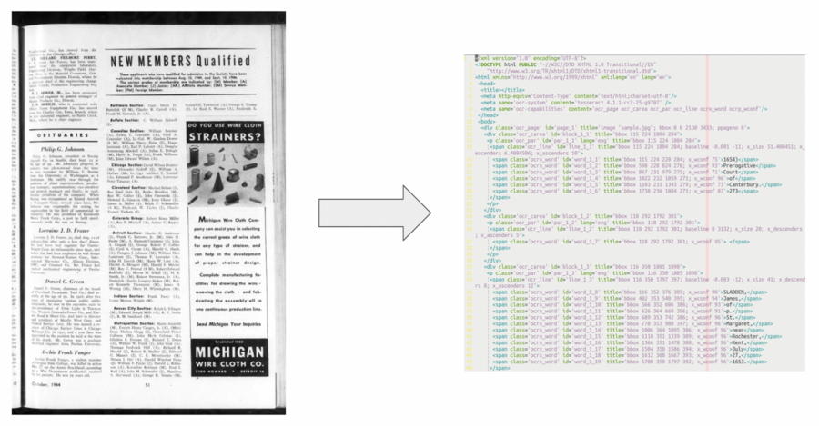

image $\rightarrow$ text, markup

# Motivating Example: OCR

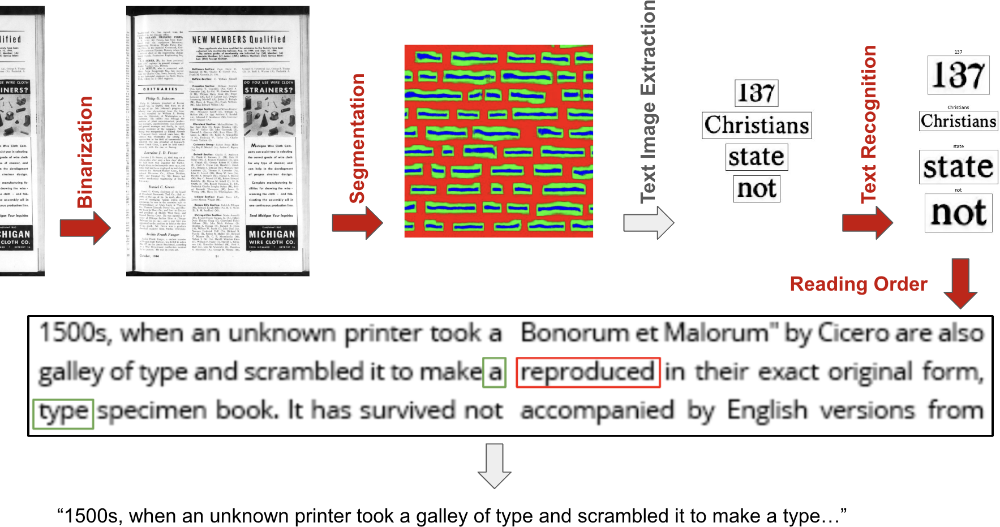

# OCR vs AV Pipeline

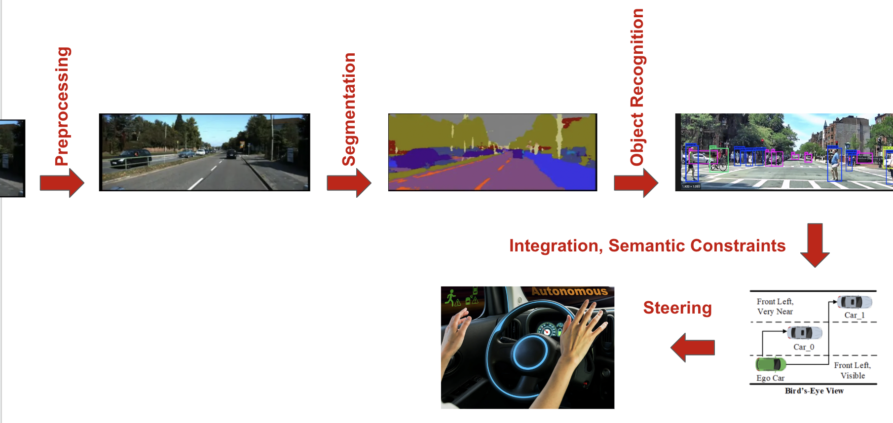

# Motivating Example: OCR

We need to train multiple models:

- preprocessing
- segmentation
- recognition
- syntactic model (language model)
- geometric model (reading order model)

This is common to many computer vision tasks using deep learning.
# OCR and Semi-Supervised Learning

Available data:

- thousands of scanned pages with manual segmentation and text
- tens of thousands of scanned pages with approximate text
- millions of scanned pages without text
- large amounts of text without document images
- the ability to generate new texts and printed documents

Typical unsupervised / semi-supervised learning problem.

# First Step: Supervised Training

Train supervised models on manually labeled / transcribed data:

- segmentation model
- image $\rightarrow$ text model

Yields good performance _on data similar to training data_.

Unlabeled training data primarily helps with generalization to new datasets.

# Using Millions of Untranscribed Pages

Idea:

- Use our or other OCR systems to transcribe those pages and use the output as training data ("pseudolabel")

Questions:

- How can using a worse OCR system work for training a better OCR system?
- Is there anything we can do to improve this?

# SEMI-SUPERVISED TEXT RECOGNITION

# Example: Word Recognition Problem

Let's focus just on recognizing words for the following examples (forget about the rest of the OCR system):

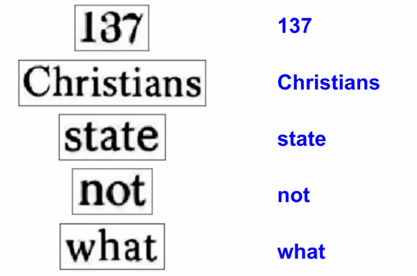

# Using Millions of Untranscribed Pages

Idea:

- run the existing OCR system, giving word images and corresponding text
- construct a new training set by...
    - rejecting any word that the OCR system has a low confidence in
    - rejecting any word that is not found in the dictionary
- this way, we obtain a new training set that contains "mostly good" training samples
- iterate this multiple times

# Why does this work?

Network estimates $P(c|x)$ ($x$: image, $c$: class)

For OCR, we know:
- true $P(c|x)$ is approximately 0 or 1 (no ambiguities)
- any uncertainty in classifier output is due to mislabeled training data
- e.g. if 20% of training data mislabeled: $\tilde{P}(c|x) = 0.8$ for true class $c$
- if we use pseudolabel $\arg\max_c\tilde{P}(c|x)$, many accidentally mislabled training labels will actually be correctly labeled
- as a result, the posterior probability will be estimated higher on the next training round and the model improves

# EM Algorithms

- latent variables in semi-supervised OCR
    - labels for unlabeled portion of training set
    - outlier status for unlabeled portion of training set
- EM algorithms recover latent variables by... 
    - "making a best guess" given the current model
    - retraining the model as if that guess is correct

# Unsupervised Learning

- identify the _latent variables_ that are being recovered
- identify the _prior assumptions / inductive biases_ in the model
- identify the _EM algorithm implementation_

# Iterated Recognition / Dataset Construction

# WEAKLY SUPERVISED TEXT RECOGNITION

# EM Training with Language Models (aka CTC)

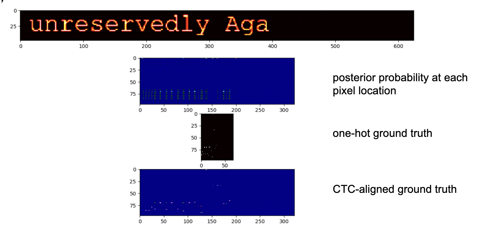

# EM Training with LSTM/Conv + CTC

- ideally, the LSTM/Conv model outputs the correct class only where the character occurs
- outputs ϵ (no character) everywhere else
- our transcript does not contain the character positions
- CTC performs _alignment_ between classifier output and transcript
- CTC estimates the most likely positions of characters given the current model

# CTC Decoding

(diagram)

# EM Training without Any Transcripts

Normal EM-Training:

- image + transcript, EM-training recovers alignment

Language Model-Based EM-Training:

- image + language model, EM-training recovers text + alignment

# EM Training, Information Theory

There always has to be _some_ source of information:

- unigram perplexity: 1000 $\leftarrow$ what the classifier outputs
- bigram perplexity: 200
- trigram perplexity: 100 $\leftarrow$ what the language model imposes
- full transcript perplexity: 1 $\leftarrow$ fully supervised training

Additionally: several bits per character for character location.

# Different Forms of Weak-/Unsupervised Learning

We have seen three different forms of weak/unsupervised training for text → image training:

- using image + transcript, lacking just the alignment/segmentation
- using image + language model only
- using just pseudolabels from weak classifier

# SELF-SUPERVISED PAGE SEGMENTATION

# Self-Supervision of Page Segmentation

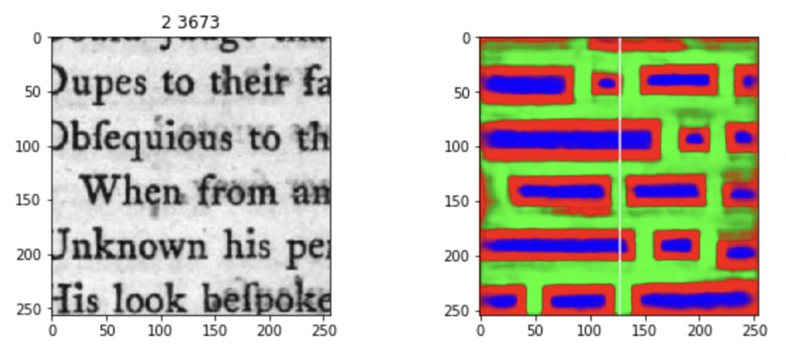

# Self-Supervision of Page Segmentation

Assume we start with errorful segmenter from small labeled training data.

Two kinds of errors:
- segmenter returns word for non-words
- segmenter misses actual words

Approach:
- validate each returned word using OCR (no OCR = not a word)
- mark everything that is not identified as a word as "don't know" and exclude from training

# Self-Supervision

Approaches to self-supervision usually incorporate prior knowledge and require some manual design:

- text recognizer
    - reject non-words from "soft labels"
    - use language models as part of EM training
- page segmentation
    - validate segmentation via OCR
    - introduce "don't know" mask during training

# Self-Supervision

Prior knowledge about the task is required to choose meaningful self-supervision tasks.

- word recognition: pseudolabels, language-model based rejection
- segmentation: verification via OCR, introduction of "don't care" regions
- object reconition, natural image segmentation: _later_

# ACTIVE LEARNING

# Active Learning

Request Help from Oracle:

- run OCR as above and send low confidence outputs to manual transcribers
    - output near decision boundaries
    - output that can maximally help the classifier improve

Clustering:

- perform clustering on character or word images and manually transcribe each cluster

# Transcription with Clustering

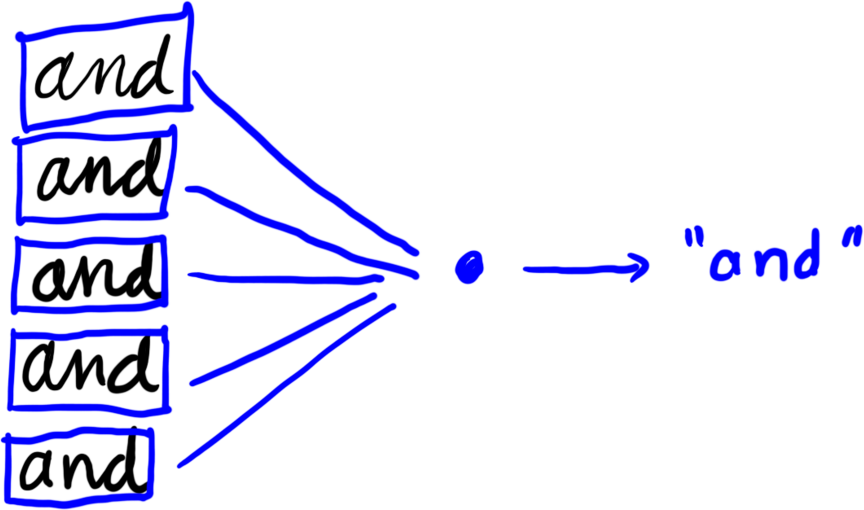

Question: what similarity measure do we use for clustering?

# OCR by Solving a Cryptogram

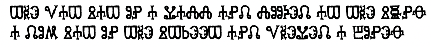

- cluster characters by shape
- use frequency and patterns to infer character identity
    - e.g.: first word is likely "THE"
        - letter frequencies
        - word frequencies
    - single letter word is likely "A"
- explicit form of many EM-based recognition algorithms

# OCR by Solving a Cryptogram

# DATA SOURCE MODELS

# Hierarchical Bayes

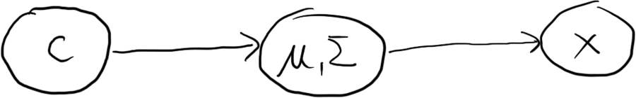

- clustering is based on a simple hierarchical Bayesian source model
- latent variables can be recovered by EM or Bayesian methods
- simple clustering assumes $\Sigma=1$
- both $c$ and $\mu$ are latent; need oracle to recover actual class labels

# Channel View

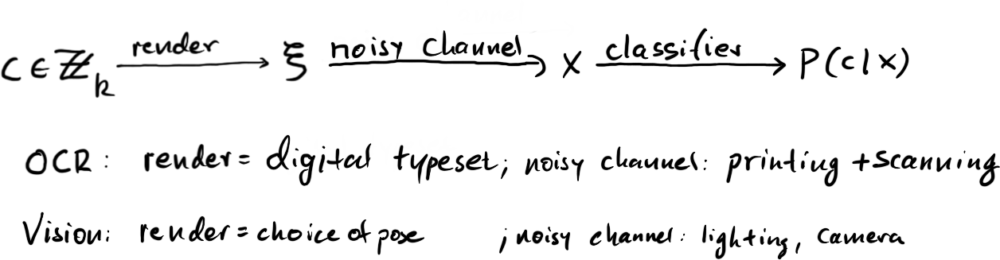

Rendering can involve transformation parameters, giving rise to _view manifolds_.

# Real View Manifold

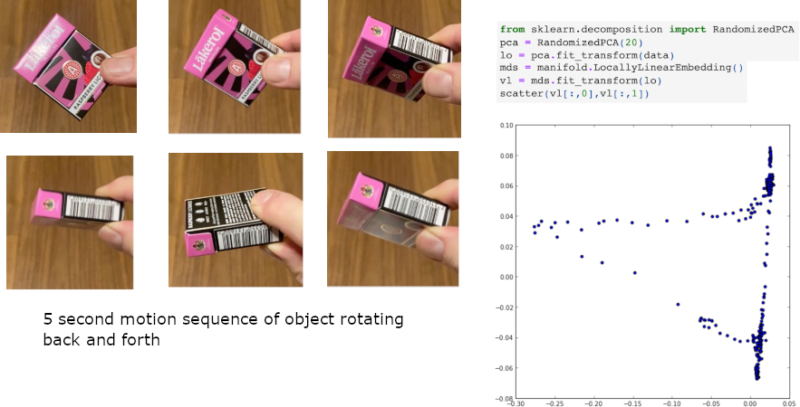

Dimensionality reduction in pixel space: $\mathbb{R}^{256} → \mathbb{R}^2$.  Video: [rotating.mp4](Figures/rotating.mp4)

# Manifolds Learning

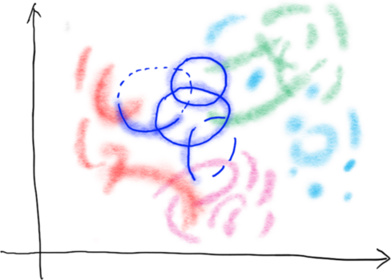

- think of real data as clouds surrounding...
- union of manifolds with boundary (only shown for blue class)
- "manifold learning" = union-of-manifold-s-with-boundary learning
# Model, View Manifold, and Noise

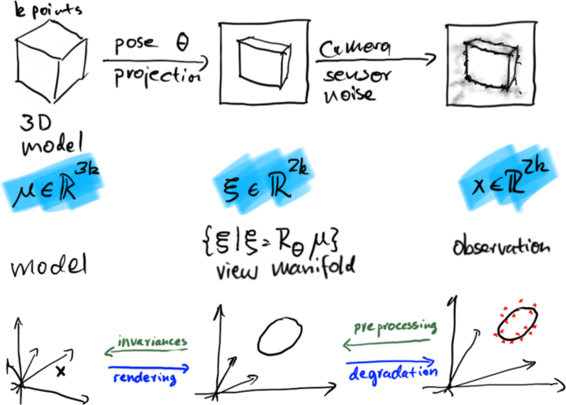

# Unsupervised Learning

Given or Learned:
- rendering
- degradation

Constructed or Learned (inverse problems):
- invariances
- preprocessing / image cleanup

CycleGAN can learn both directions simultaneously with no supervision.

# TRAINING DATA GENERATION / DEGRADATION

# Artificial Data Generation

This is the "forward path" in the channel view of recognition:

- digital typesetting = perfect "artificial" document generation
- take any text, generate pages of perfect text
- for OCR, we need "degraded images"
    - printing, scanning, photographing, photocopying, ...
- physical processes for document image degradataion are well known
# Artificial Data Generation

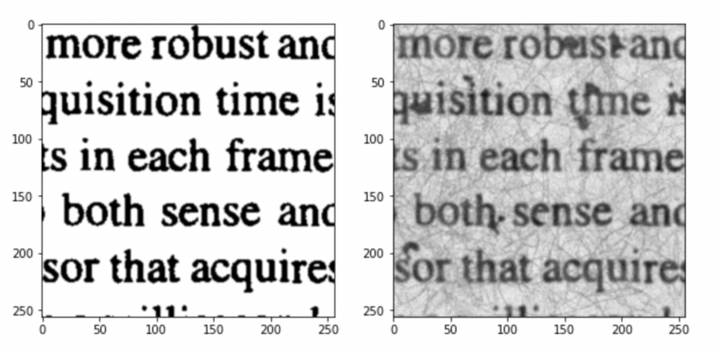

# Document Image Restoration

- recognition is easier if documents are not degraded
- can we restore the "clean" image via unsupervised learning?

AV/object recognition: image translation prior to recognition
# Classical Document Image Restoration

- binarization
    - optimal thresholding
    - optimal linear filtering (deconvolution, etc.)
    - clustering
    - performance-based dynamic thresholding
- deep learning
    - supervised restoration (LSTM, pix2pix)
    - unsupervised restoration via CycleGAN
# Otsu's Method: "Optimal" Thresholding

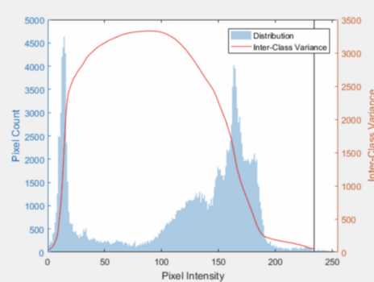

Otsu's method: 
- manually constructed inverse degradation model based on prior knowledge/assumptions
- assume some kind of mixture model of image pixel generation
- maximize inter-class variance

# Performance-Based Thresholding

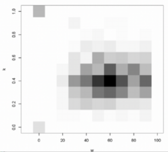

- run thresholding with many parameters
- pick the parameters that yield the best OCR output
- no transcript, so use proxy
    - use statistics/classifier, or #words in dictionary
    - closely related to GAN methods
- assumption/prior: local thresholding = good way of inverting degradation model
# Binarization by Supervised Deep Learning

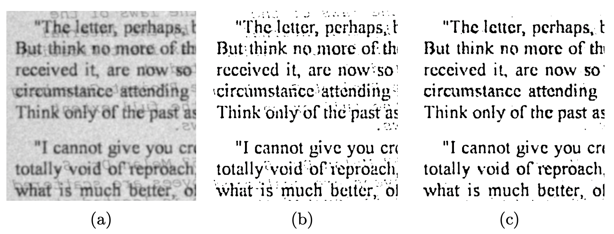

(a) original, (b) Sauvola, (c) LSTM-based binarization

# Self-Supervised Training for Binarization

1. generate clean images, degrade with degradation model
    - takes advantage of prior knowledge of degradataion models
2. take degraded images, use performance-based thresholding
    - takes advantage of knowledge of statistical properties of output
# CycleGAN for Document Preprocessing

CycleGAN replaces all those components with trainable networks:

- clean image $\rightarrow$ degraded image
- degraded image $\rightarrow$ clean image
- clean image detector
- degraded image detector

These correspond to the forward and backward arrows in our channel model.

CycleGAN can be trained end-to-end without any labeled data or (significant) prior assumptions.

# CycleGAN for Document Preprocessing

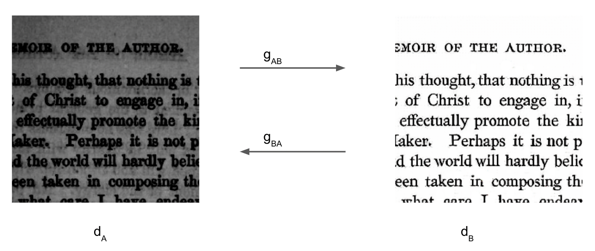

# End-to-End OCR

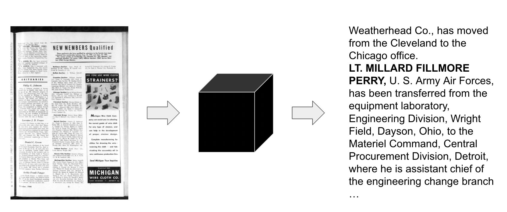

# End-to-End OCR

Recent Developments

- transformer models permit full end-to-end training for image-to-text transcriptions
- do not need intermediate segmentation, text-line recognition

# LayTR Multicolun Recognition

Image-to-HTML tags.

# LayTR Table Recognition

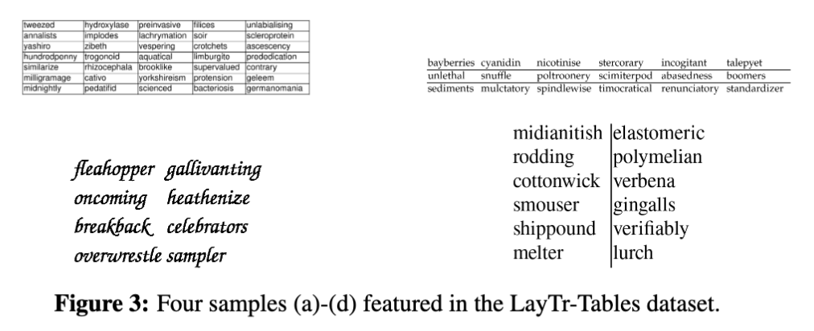

Image-to-HTML tags.

# Self-Supervised Training

- apply the same principles
- train an initial model using supervised data
- compute output on unlabeled data ("soft labels")
- correct the output using language models
- retrain
- possibly use auxiliary tasks for pretraining (later)

# Or has it been solved already...

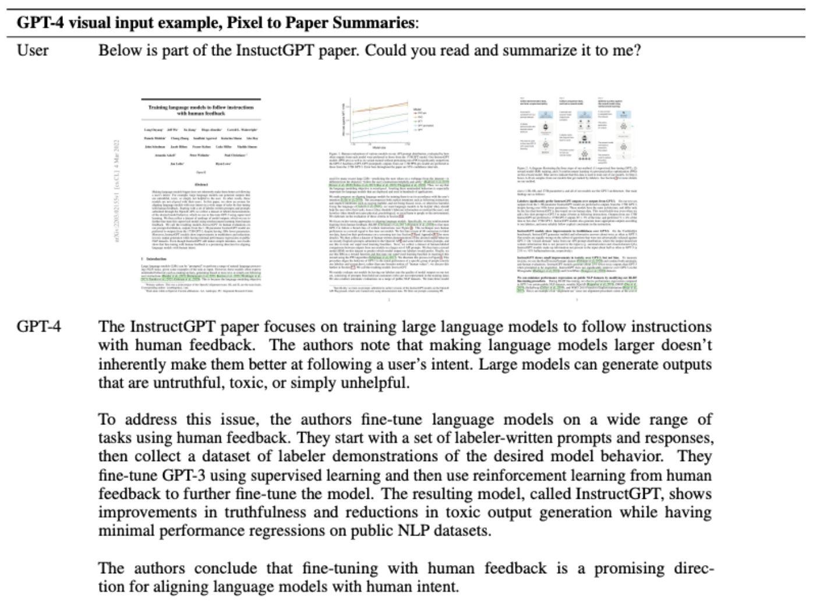

# Exploiting Foundation Models

- CLIP
    - image features
    - image quality
    - image type
    - script
- LLMs
    - language modeling during recognition
    - OCR correction
- uses
    - full recognition pipeline (slow!)
    - training data generation followed by "distillation"

# Summary

In the OCR example, we have seen most of the major concepts of unsupervised and semi-supervised training:

- EM training (aka soft labeling)
- use of language modeling as data source
- clustering
- unsupervised preprocessing / image enhancement
