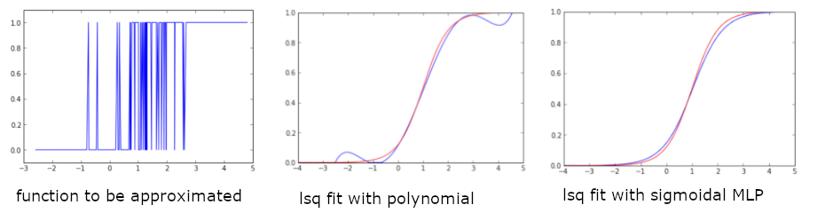
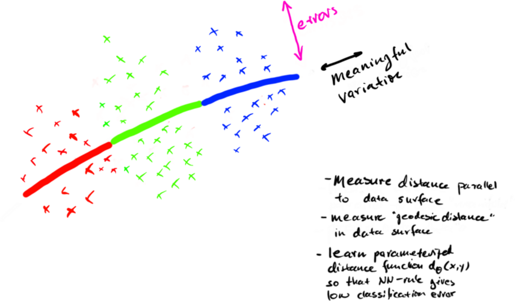
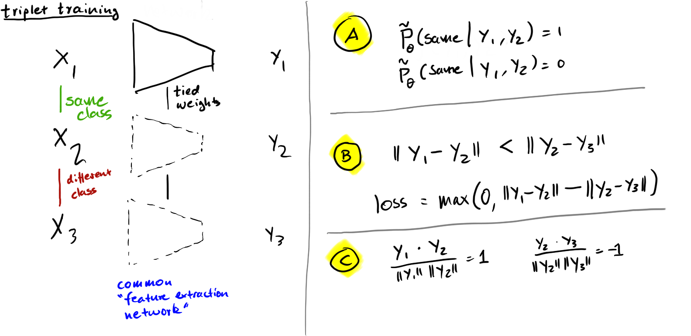

# STATISTICAL FOUNDATIONS

# Supervised Learning Problem

Given: samples $x_i$ with labels $y_i$ drawn from some distribution $p(x,y)$

Goal: predict the label $y$ for a new sample $x$.

Assume:

- $x ∈ \mathbb{R}^n$ - continuous measurements (e.g., images, speech, etc.)
- $y ∈ \{1...N_c\}$ - discrete class labels (classification problem)

# Bayes Optimal Classifier

Assume $y$ is discrete.

To minimize the expected 0-1 loss, classify according to the posterior probability of the class given the data.

This is called the Bayes optimal classifier.

$D(x) = \arg\max_y P(y|x)$

NB: 
- $D(x)$ is the _decision function_.
- $\arg\max_y P(y|x)$ is really shorthand for $\arg\max_i P(y=i|x)$
- any function monotonically related to posterior gives the same decision function

# Neural Networks and Bayes Optimal Classifiers

Neural networks are (universal) approximators for discriminant functions.

- neural networks $f_\theta(x)$ trained with one-hot softmax or MSE approximate the posterior $P(y|x)$
- we use the same $\arg\max_y$ approach to deriving a decision function from discriminant functions
- this approximates the Bayes optimal classifier by approximating $P(y|x)$

# Function Approximation for $P(y|x)$

- lsq fit of any smooth function approximates posteriors
- meaningful posterior probabilities = approximation is not "good"

# Bayes Formula

$P(y|x) = \frac{p(x|y)P(y)}{p(x)} = \frac{p(x, y)}{p(x)}$

Relationship between:

- prior class probability $P(y)$
- sample distribution, "evidence" $p(x)$
- posterior probability $P(y|x)$
- class conditional density $p(x|y)$

(I will use $P$ for discrete distributions and $p$ for densities.)

# Bayes Formula: Learning Tasks

Any of the four factors in Bayes formula can be learned:
- posterior probability $P(y|x)$ - usually learned directly in supervised learning
- prior class probability $P(y)$ - easy to estimate by counting, useful for some classifier retargeting
- sample distribution, "evidence" $p(x)$ - a density estimation problem, useful for outlier detection, structure discovery, domain adaptation, sample generation
- class conditional density $p(x|y)$ - a density estimation problem, useful for classification, sample generation, structure discovery, etc.

We can also apply Bayes formula to learn one factor in terms of others, e.g., $p(x|y) = P(y|x) p(x) / P(y)$

# Estimating Densities

Construct new densities from:

- parametric densities: normal, Cauchy, uniform, ...
- Cartesian product
- mixture densities
- linear and non-linear transformations of densities
- Bayes formula

Carefully maintain normalization.

NB: This is the basis of deep learning density estimators we will cover later.

# Not Estimating Densities

In many cases, we don't need an explicit way of computing $p(x)$, we may simply need to be able to...

- only sample from $p(x)$ but not evaluate (e.g. generative models)
- determine whether $p(x) > p(x')$

Some deep learning models take advantage of this.

# Parametric Densities

Uniform Density

- $p(x) = \mathbb{1}_{x\in[0,1]^n}$

Normal Density

- $p(x) = \frac{1}{\sigma\sqrt{2\pi}} e^{-\frac{1}{2}(\frac{x-\mu}{\sigma})^2}$
- $p(x) = \det(2\pi\Sigma)^{-1/2} \exp(-\frac{1}{2} (x-\mu)^T \Sigma^{-1} (x-\mu))$
- maximum likelihood estimates of parameters either closed form or by gradient descent

NB: multivariate normal is Cartesian product followed by linear transformations

# Mixture Densities

Any convex combination of densities is another density.

Let $p_i(x)$, $i=1...k$, be densities.

Let $\lambda_i ∈ [0, 1]$ and $∑ \lambda_i = 1$, then

- $p(x) = ∑_i \lambda_i p_i(x)$

is another density.

# Transformations of Densities

If $x ∼ p(x)$, and $y = f(x)$, then obviously there is some $p(y)$ such that $y ∼ p(y)$

We can use this to construct complex densities from simple ones, in particular if $f$ is represented by a trainable DNN.
We will cover later what the form of $p(y)$ is in terms of $p(x)$

Simple example, linear transformation:

$y = f(x) = M ⋅ x + b$

If $x ∼ {\cal N}(0, 1)$, then $y ∼ {\cal N}(\mu, \Sigma)$

Exercise: how do $(M, b)$ relate to $(\mu, \Sigma)$?

# Nearest Neighbor Classification

- classify each sample based on the class of its nearest ($k$-nearest) neighbor(s)
- if $e^*$ is the Bayes error rate, then $k$-nearest neighbor error $e_k$ asymptotically achieves $e^* ≤ e_k ≤ e^* (2 - \frac{k}{k-1} e^*)$
- this limit works only for very large numbers of "training samples"
- this assumes samples come from a metric space, but assumes little about the metric
- the limit simply assumes that we have enough samples that the class conditional densities around a sample $x$ up to the $k$-nearest neighbor are approximate constant

# Learned Distance Functions and Nearest Neighbor Classification

- nearest neighbor classification relies on some distance measure $d(x, y)$ to find the $k$ nearest neighbors of a sample
- some distance measures work may work better than others
- e.g., a distance measure may measure only in the direction of meaningful sample variation, ignoring "noise dimensions"
- Examples:
    - Mahalanobis distance (based on covariance matrix)
    - Siamese networks (deep learning)
- distance measures can be trained on a small labeled training set and then be used to generalize to a large unlabeled training set; for clustering; etc.

# Learned Distance Functions

# Siamese Networks

# "Linear Siamese Networks"

What if $y = f(x)$ is linear?

- we obtain _some_ Mahalanobis distance
- this matrix differs from both PCA and ICA in general
- even if the class conditional densities are Gaussian, this may not be an optimal distance measure, since decision boundaries can be quaddratic
- c.f. Fisher linear discriminant analysis
- c.f. decision boundaries for Gaussian class conditional densities

# Summary

- optimal classification is governed by posterior probabilities and loss functions
- Bayes rules identifies the different probability functions we can learn: $P(y)$, $p(x)$, $P(y|x)$, $p(x|y)$
- we can construct complicated densities from simple densities by representing them as non-linear transformations of simple densities
- learning distance functions can also be helpful for unsupervised or semi-supervised learning
- we can use Siamese networks to learn useful feature extractors and distance functions