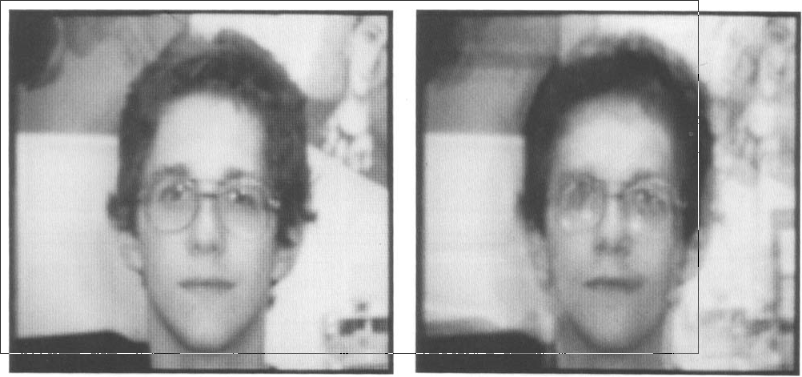
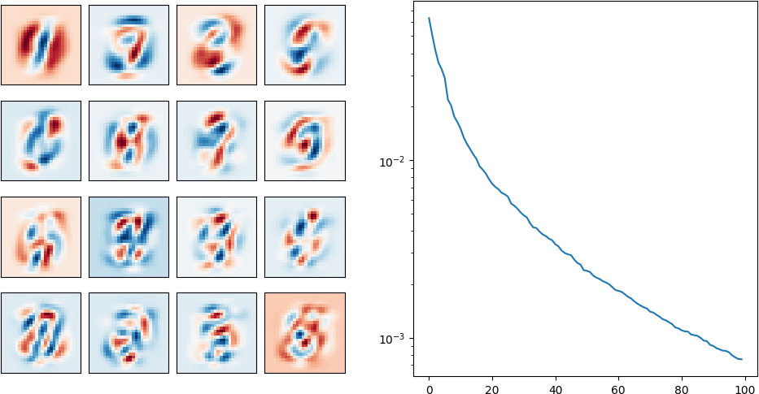
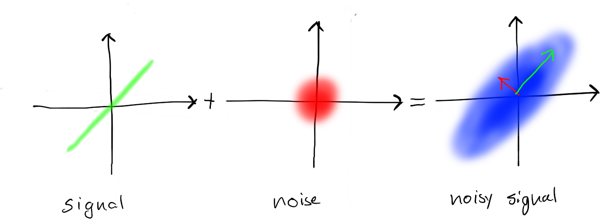
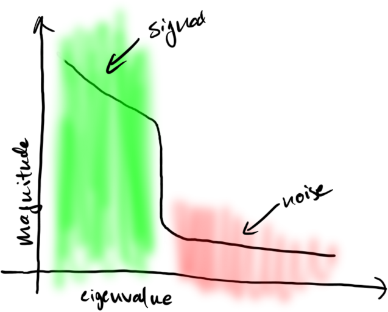
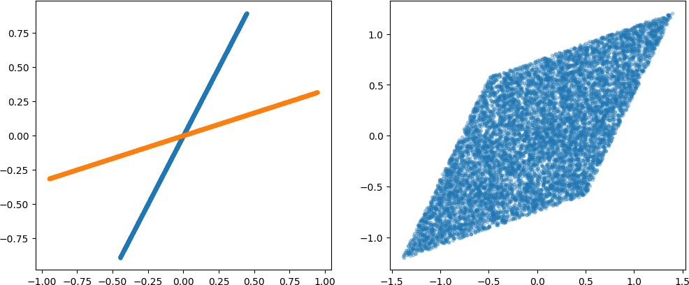
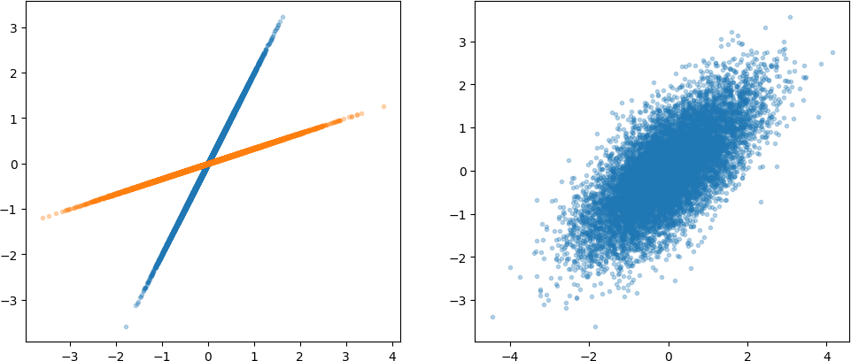
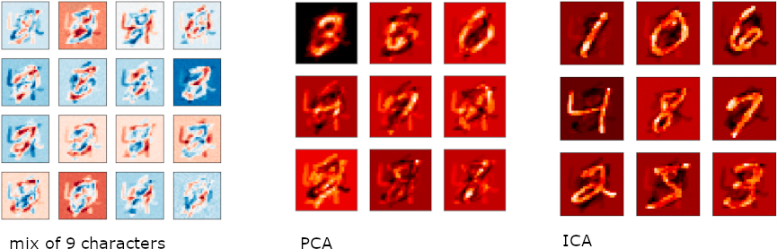
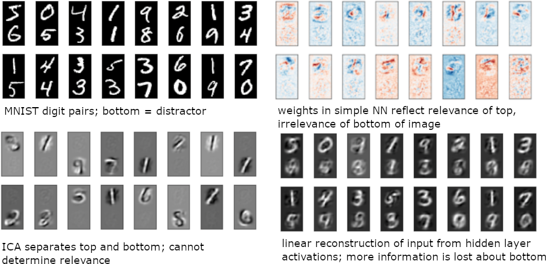
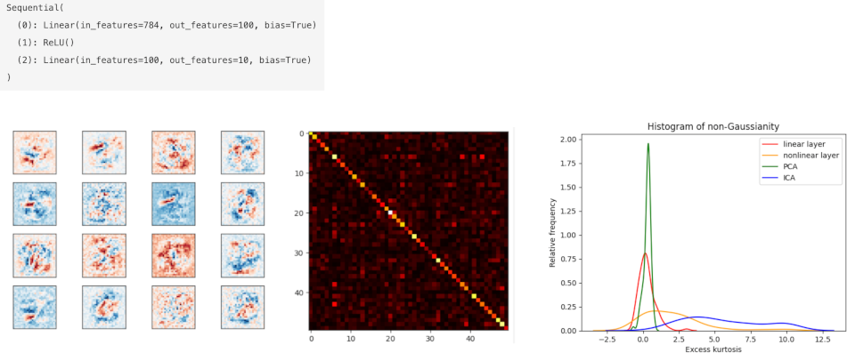
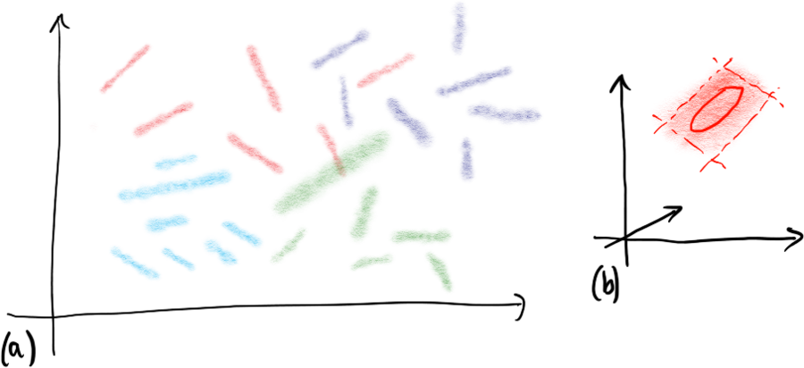

# LINEAR METHODS
# Linear Methods

Examples:
- PCA, ICA, $k$-means, GMM
- can often be trained directly w/o gradient descent

Why?
- many deep learning methods are generalizations of linear methods
    - replace $y = M ⋅ x + b$ with $y = f_\theta(x)$
- deep neural networks are usually locally linear
    - linear model is basis for analysis of deep networks

# PCA
# Example: Eigenfaces

 

Turk and Pentland, JCN 1991

# Example: MNIST

 

# PCA

- take original data
- perform PCA
    - center and compute covariance matrix
    - project onto subspace with high variances
- perform nearest neighbor classification after projection
- generally results in better performance than nearest neighbor in original space
- why?

# Separation of Signal and Noise using PCA

# Separation of Signal and Noise using PCA

# Example: PCA Reconstruction of MNIST

 

# Separation of Signal and Noise using PCA

Assume:
- $x = ξ + ν$ - signal $\xi$ and additive noise $\nu$
- variation in the signal $\xi$ is in a linear subspace
- noise is Gaussian and small relative to variation in signal

Then:
- "large PCA components" correspond to the signal
- "small PCA components" correspond to noise

"Projection onto data manifold."

# PCA and Compression

Notice that we can use PCA for compression:

- keep only the "largest PCA componenets"
- project the original signal onto those components
- code the projected values

This is a simple example of the relationship between unsupervised learning and compression.

# Nearest Neighbor and PCA

We can perform nearest neighbor with PCA in several ways:

- transform the original data with $y = Mx+b$ and perform nearest neighbor classification on the $y$
    - "latent representation"
- project the original data into subspace $x' = M^T M x$ and perform nearest neighbor classification on the projected $x'$
    - "projection onto data manifold", "denoising"
- define a new distance function using the Mahalanobis distance
    - "metric learning", "Siamese networks"

# ICA

# Prior Assumptions

- PCA
    - meaningful signal is large
    - noise is small
- ICA
    - meaningful signal(s) is/are non-Gaussian
    - noise is Gaussian

Both are approximately satisfied for "view manifolds" of 3D objects and in many other cases.

# Unsupervised Separation of Signal and Noise using ICA

Assume:
- $x = ∑ \xi_i v_i = M ⋅ \xi$ 
    - the individual $\xi_i$ are not Gaussian and independent
    - the $v_i$ are non-colinear unit vectors

Then:
- ICA will recover the $v_i$ and lets us recover the underlying $\xi_i$

Therefore: unsupervised recovery of $\xi$ from samples drawn according to $p(x)$

# ICA Implementation

Find a matrix $W \in \mathbb{R}^{k\times n}$ that is orthonormal $ W W^T = 1 $ that

- the components of $W\cdot x$ have minimal mutual information
- the components of $W\cdot x$ are maximally non-Gaussian
- that minimizes $\mathbb{E}|| W\cdot x ||_1$

NB:
- any of these can be used as objective functions
- no reference to reconstruction error; does not minimize reconstruction error
- full ICA spans full input space

# "Neural Network" ICA = RICA

Optimize $W$ via gradient descent over the data matrix $X$:

$\hat{W} = \arg\min_w \lambda ||W X||_1 + || W^T W x - x ||^2_2$

We may additionally explicitly constrain $W^T W = \mathbb{1}$.

- For $\lambda \rightarrow \infty$ and whitened data, this is equivalent to ICA.
- For $\lambda = 0$, this is simply PCA or a linear autoencoder.

# ICA and Non-Gaussian Densities

 

Projections along the two original directions give rise to maximal non-Gaussian distributions (uniform, in this case).

# ICA and Gaussian Densities

 

If the component densities are Gaussian, we cannot recover their directions.

# PCA vs ICA on Mixtures of MNIST Characters

# Irrelevant Features, ICA, and Neural Networks

# Do Neural Network Layers perform ICA / RICA?

# GAUSSIAN MIXTURE MODELS

# Gaussian Mixture Models

Why?

- good approximation to many real densities
- implicit or explicit in some deep learning models
- introduction to latent variables and the EM algorithm

# Gaussian Mixture Models and $k$-Means

$p(x) = \sum_j \lambda_j {\cal N}(x; \mu_j, \Sigma_j)$

where

$∑ \lambda_j = 1, \lambda_j ∈ [0, 1]$

Special case: $k$-means ($Σ_j=1$)

# EM Algorithm and Latent Variables

For each sample $x_i$, the latent variable is cluster membership.

1. initialize parameters randomly
2. maximize $∏ p(x_i)$ by assigning $x_i$ to best cluster $j$
    - assignment is latent variable
3. recompute $\mu_j$ and $\Sigma_j$ using this assignment
4. repeat at step 2

A kind of "gradient descent" or "coordinate descent"; may get trapped in local minima.

# The Meaning of Mixture Components

- many classification problems are mixture density problems
    - each class consists of multiple prototypes
    - prototypes can undergo transformations
    - after transformation there is additive Gaussian noise
- Gaussian mixture models can represent both...
    - (linear) transformations (small variance directions)
    - additive noise (large variance directions)

# Linear Manifolds Learning in Vision

(a) Gaussian mixtures are collections of "linear manifolds with errors" (in $\mathbb{R}^{65536}$)
(b) $P⋅R⋅ξ + p$, true: $R∈SO(3)$, approx: $R∈\mathbb{R}^{3×3}$
Identify mixture components, then just assign a class label to each component.

# Relationships between Linear Models

All these models represent samples $x$ as a linear combination $z$ of basis vectors.

$x = M ⋅ z$

Different constraints on $z$ and different objectives:

- PCA - MSE objective, $z$ has smaller dimension
- ICA - components of $z$ are independent / non-Gaussian
- $k$-Means, VQ - MSE objective, $z$ are basis vectors ("one hot")
- NNMF - all components of $z$ are positive

# Summary

"Traditional" Unsupervised Learning Techniques:

- PCA - local decomposition into signal/noise components
- Mahalanobis distance - automatic distance learning
- ICA - identify independent components
- mixture density estimation - identify mixture components, often corresponding to class conditional densities

Many of the idea for unsupervised deep learning are already present here in the linear case.

<!--
# Nearest Neighbor Classification

# Siamese Networks

Limitations

- linearity
- bad feature ...

- VQ -- unit basis vectors
- PCA -- orthogonal basis
- NMF -- non-negative basis and components, sparsity
- ICA -- independent components
- Robust PCA -- use absolute error
- sparse matrix factorization, sparse coding -- PCA with L1 regularization on weights and components
- structured sparsity -- impose "parts are convex regions"
- kernel PCA -- nonlinear PCA using kernels
- probabilistic PCA -- assume z ~ N(0,1) and x ~ (Wz, sigma 1), connection to factor analysis
- orthogonality vs sparsity

- try on:
    - MNIST
    - faces

- sammon mapping
- tensor factorization
- multidimensional scaling
- self-organizing map

# concrete example: OCR and character recognition

-->