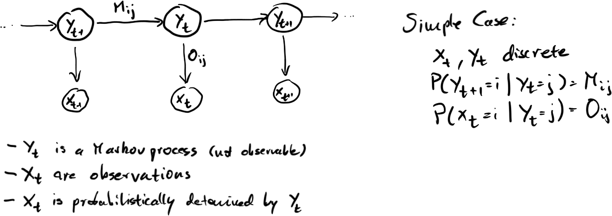

# SEQUENCE MODELING

# Sequence Modeling

- classic
    - probabilistic language models (n-grams, backoff, WFST)
    - LPC
    - HMM
    - images: HMM-OCR, turbo coding, inpainting
- deep learning
    - word2vec
    - character level LSTM
    - GPT
    - BERT
    - MAE

# Type of Sequences

- time series
    - climate data
    - stock market
    - scientific measurements
    - health data
- text
    - sequence of characters
    - sequence of words
- images and videos
    - various ways of turning into sequences

# CLASSICAL THEORY

# Self Supervised Learning and Sequences

Discrete time sequence:

 - $x_1, x_2, ..., x_t, x_{t+1}$

Sequence learning is naturally unsupervised/self-supervised:

- Predict $x_{t+1}$ given $\{x_t ... x_1\}$

The sequence itself serves as a source of supervised training data.

# Language Models

For language models, the $x_t$ come from a finite alphabet $\Sigma \cong \mathbb{Z}_k$

A _string_ is a finite sequence of symbols: $s = s_1 ... s_l \in \Sigma^*$

A _language model_ is an estimate of the true distribution $P(s)$ over strings.

# Language Models by Counting

If the language model has strings of length less than some $L$, there is a finite number of tototal possible strings.

We can sample a training set $S = {s_1,...,s_N}$ from $p(s)$ and estimate:

$\hat{P}(s) = \frac{1}{N}\#\{s_i\in S: s_i=s\}$

This is impractical for large $L$.

# Factoring the Language Model

Simple conditional expansion:

$P(s) = P(s_l | s_{l-1} ... s_1) P(s_{l-1} ... s_1)$

Apply recursively:

$P(s) = P(s_l | s_{l-1} ... s_1) P(s_{l-1} | s_{l-2} ... s_1) ... P(s_1)$

Assume: $P(s_i | s_{i-1} ... s_1) = P(s_i | s_{i-1})$

$P(s) = P(s_l | s_{l-1}) P(s_{l-1} | s_{l-2}) ... P(s_1)$

This is the bigram model. It is a simple kind of Bayesian network.

# Why autoregressive?

There are lots of probability estimates we could compute, e.g. using left and right context.

$P(s_l | s_{l+2}, s_{l+1}, s_{l-1}, s_{l-2})$

We factor left to right (causally) because:

- we need a directed acyclic graph for efficient belief propagation / inference
- we often operate "causally" and "in real time"

NB: once $P(s)$ has been computed, it includes both left and right context, regardless of factorization

# Easy Sampling

Sampling from $P(s)$:

- sample $s_1$ according to the prior $P(s_1)$
- sample $s_2$ according to $P(s_2 | s_1)$
- sample $s_t$ according to $P(s_t | s_{t-1} ... s_1) \approx P(s_t | s_{t-1})$

Deal with finite sequences and positional dependencies by having start and end tokens.

# Estimating Parameters for the Bigram Model

$P(s) = P(s_l | s_{l-1}) P(s_{l-1} | s_{l-2}) ... P(s_1)$

How do we estimate the $P(s_t | s_{t-1})$?

Counting: "What is the distribution of words following the word 'giraffe'?"

# Estimating Parameters for the Bigram Model

```Python
bigram = {}
for i in range(len(shakespeare)-1):
    word = shakespeare[i]
    bigram.setdefault(shakespeare[i], Counter())[shakespeare[i+1]] += 1

for k, v in bigram["king"].most_common(10):
    print("king %10s %.4f" % (k[:10], v/n))
```

```
king      henry 0.1325
king    richard 0.0914
king        and 0.0562
king     edward 0.0500
king       john 0.0408
king         of 0.0345
king          i 0.0191
king         is 0.0178
king     philip 0.0171
king         my 0.0128
```

# n-Grams


```n = 3
ngrams = {}
for i in range(len(shakespeare)-n):
    context = tuple(shakespeare[i:i+n-1])
    ngrams.setdefault(context, Counter())[shakespeare[i+n-1]] += 1Python

ngrams[("king", "and")].most_common(10)
```

```
[('queen', 15),
 ('his', 10),
 ('all', 5),
 ('not', 5),
 ('the', 4),
 ('commonweal', 4),
 ('who', 3),
 ('if', 3),
 ('i', 2),
 ('polonius', 2)]
```

# Backoff and Smoothing

For large $n$, many strings may not occur in the training set:

- `ngrams[("king", "and", "many", "other")].most_common(10)`

yields no results, yet probability isn't zero. What do we do?

Try shorter n-grams:

- `ngrams[("and", "many", "other")].most_common(10)`
- `ngrams[("many", "other")].most_common(10)`
- `ngrams[("other")].most_common(10)`

Back-off: approximate $P(x_t|long context)$ using $P(x_t|shorter context)$

# Sampling from Shakespeare

Training: complete works of Shakespeare, tokens=words

n=1

- Can, ., a to see out BERTRAM eyes I . . And true sphere shall see?
- Not . judgment, experience The, daily, and,, and soundly . BY in we hair 
- books- laid like .' To How shepherd me here fray les . and . thy, smelt, me

n=2

- friend doth still we send us'd from whom shouldst thou art just.
- whom, no bush suppos'd to see thy youtli and fearful of duty.
- ignoble traitor; and had your evils.

# Sampling from Shakespeare

n=3

- wak'd, As thou lov'st me, here he comes- one of the realm shall not hedge us out
- clear of thee thine uncles and myself Have travail'd in Rouen.
- and his man, sir; namely, the dancing banners of the Emperal's men.

n=5

- Then shall we hear their 'larum, and they ours.
- want, Taste grief, need friends: subjected thus, How can you say to this?
- a quiet sword; by the means whereof' a faces it out, but fights not.

# Deep Learning and Sequences

Deep learning models are really good at modeling conditional probabilities:

$$P(s_t | s_{t-1} ... s_1) = f_\theta(s_{t-1} ... s_1)$$

where $f_\theta$ is some kind of neural network.

This means:

- sequentially estimate conditional probabilities
- multiply the conditional probabilities to obtain the final distribution
- "autoregressive models"

# Sequence Models for Classification

Classification: 

$$P(c | s_t ... s_1) = \frac{P(s_t ... s_1 | c) P(c)}{P(s_t ... s_1)}$$

Translation:

$$P(o_t ... o_1 | s_t ... s_1) = P(o_t | o_{t-1} ... o_1, s_t ... s_1) = ...$$

Common classication tasks for text: sentiment, genre, topic
# Evaluation of Sequence Models

- perplexity
- BLEU score
- task specific score:
    - speech recognition error rate
    - classification error rate
- user studies

# Hidden Markov Models



Popular b/c of efficient and scalable algorithms for training and inference.

# Generalizations of HMMs

- sequence-to-sequence (transducers)
    - c.f. transformer models
- replace inputs and outputs with vectors in $\mathbb{R}^n$
    - e.g. via vector quantization
- replace transition probabilities with potentials (CRFs)
    - c.f. energy-based learning

"Traditional" speech recognition with HMMs combines many/all these approaches.

We find many of the same ideas in deep learning now.
