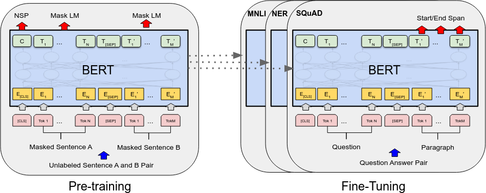
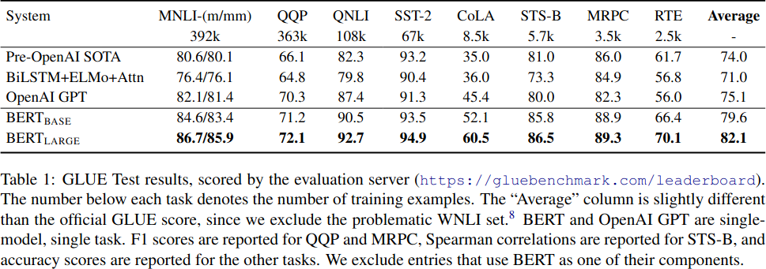
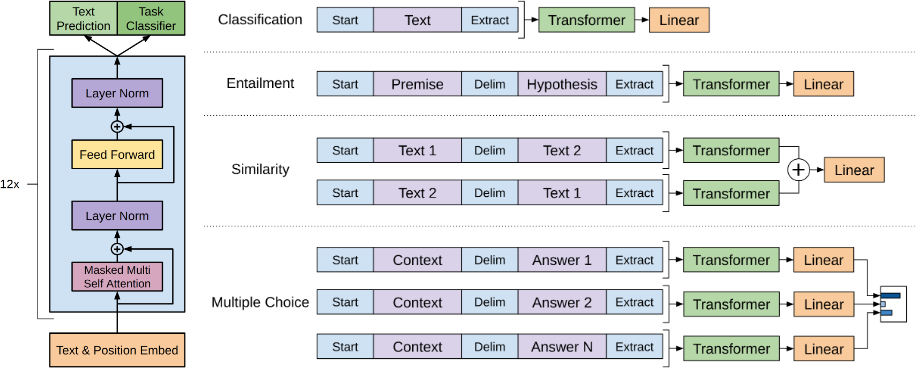
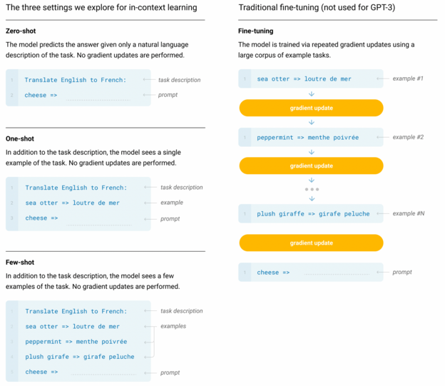

# UNSUPERVISED DEEP LEARNING FOR NLP

# Language Modeling for Its Own Sake

Predict the next word in a sequence:

- generate new text (sampling)
- assign probabilities to strings (language modeling)

Examples:

- n-gram models, finite state transducers
- TDNN, LSTM models (e.g. Graves 2013, Arxiv 1308.0850)

# Language Modeling for Transfer Learning

Task: predict words in sequences
Purpose: obtain a useful _embedding_; transfer learning; generation

Examples:

- word2vec
- ELMO
- BERT, GPT, etc.

# word2vec and ELMO

- self-supervised task: predict word from context
- bidirectional (since we're not using it for autoregressive decoding)
- embeddings used as inputs to other systems

# TRANSFORMERS (QUICK REVIEW)

# Transformer Architecture

- fundamental change in sequence modeling
    - arbitrarily long term dependencies through content-addressability
    - all time steps trainable in parallel

- history
    - added attention mechanisms to LSTM to improve performance
    - later, eliminated the LSTM altogether and retained just attention

# Transformers are Trained in Parallel

(Like convolutional networks.)

# Transformers are Set Learners

The order of inputs do a transformer doesn't matter as far as the model is concerned.

# For Sequence Tasks, we use Autoregressive Decoding

# Attention in Transformers

# Sequences are Modeled via Positional Encodings

# SELF-SUPERVISED LANGUAGE LEARNING WITH TRANSFORMERS

# BERT

Basics:

- architecture: multi-layer transformer blocks
- dataset: books (800M words), Wikipedia (250M words)

Intended Use:

- transfer learning for NLP tasks (more general than word embeddings)

# BERT - Self-Supervised Tasks

"Cats like playing with string."

Task 1:
- corrupt 15% of the words: "Cats like [MASK] with string."
- restore original string

Task 2:
- sentence entailment (a classificaiton task)
- "My cat likes [MASK] with string. [SEP] He [MASK] likes milk." -- True

# BERT Pretraining vs Fine Tuning

 

Devlin et al., 2019, Arxiv 1810.04805v2

# BERT - Results on GLUE Benchmarks

 

Devlin et al., 2019, Arxiv 1810.04805v2

# GPT-Style Models (Generative Pre-Training)

Basics:

- transformers with autoregressive language modeling
- model size: 117 million (GPT) TO 175 billion (GPT-3) parameters
- data: up to 400 billion words (GPT-3)
    - books, WebText, huge crawl cleaned with WebText Model

Intended Use:

- text generation, direct question answering
- transfer learning (fine-tuning on labeled data)
- few-shot learning via prompting

# GPT Fine Tuning

 
pretraining: next-word-prediction
fine-tuning: task-only OR next-word + task

Radford et al. 2018 (OpenAI)

# GPT-3 and Few-Shot "Learning"

# Example: GPT-3 Use of Definitions

# How? Sources of Translations in large Corpora

# BERT vs Prompting

Approaches:

- BERT solves novel tasks by training _heads_ on top of its embeddings
- GPT-3 solves novel tasks through prompting

Characteristics:

- BERT+trained head gives better results than GPT-3 given the same compute resources
- GPT-3 requires no retraining for novel tasks
- GPT-3 performance no novel tasks is hard to predict

# T5 and exT5

- T5 and ExT5 are sequence-to-sequence models
- they are trained both unsupervised and supervised
- task prompting is incorporated into the training data
- supervised training can be done completely in terms of natural language

# ExT5

# GENERAL DISCUSSION

# Perplexity of GPT-3

|model    | perplexity |
|---------|------------|
| unigram | 962        |
| bigram  | 170        |
| trigram | 109        |
| GPT-3   |  20        |

This low perplexity appears to require understanding more and more context / semantics.

# Unsupervised / Self-Supervised Sequence Learning

Why does it work so well?

- large number of choices, most of them wrong = many bits of unsupervised information from each word prediction
    - c.f. using language models as speech/OCR ground truth
- captures semantic information because it helps reduce perplexity

# Sequence Learning vs Intelligence

Large scale semi-supervised training of language models are NOT reasonable models of human cognition:

- humans acquire syntax + semantics with exposure to less than 200M words
- humans derive meaning of language from semantic world models
- semi-supervised language models = Chinese room experiment

However:

- deep language models statistically combined with other sensory modalities might be!

# Take-Home Messages

- transformer models + GPUs + huge amounts of text now allow us to extract high quality syntactic and semantic information
- most of the traditional work on syntax, semantics, knowledge representation, etc. has been made practically obsolete by such models
- but... these models are largely black boxes
- for solving novel problems, we have a choice between...
    - prompt engineering for pre-trained models
    - fine-tuning by traditional transfer learning
    - fine-tuning by text-to-text training
