# UNSUPERVISED DEEP LEARNING FOR NLP

# Deep Learning for Natural Language

- important, successful examples of unsupervised learning
- these usually use some kind of sequence prediction to learn useful representations
- we're looking at these examples for _ideas_
- state-of-the-art models often incorporate these ideas, but use different models

# Deep Learning for Natural Language

- word2vec, GloVe (2013) -- simple nnet, limited context
- CoVe (2016) -- contextual embeddings, transfer learning, full context
- ELMo (2018) -- LSTM, self-supervised, full context
- GPT (2018) -- transformer-based, autoregressive
- BERT (2018) -- transformer based, masked

# word2vec

Purpose:

- "traditional" sequence coding for NLP is word = integer
- problems:
    - very large one-hot encoding (50000 dimensional)
    - same representation independent of context
- want:
    - lower dimensional representation
    - semantically meaningful encoding

# word2vec

Want a semantically meaningful encoding:

- "red" and "green" are both colors and should be close in some dimensions
- "fast car" and "fast rope" should have different representations for "fast"

Supervised:
- convert WordNet to vectorial encoding somehow

Unsupervised / Self-Supervised:
- predict word from context somehow and transfer representation

# word2vec

Approach:

- move a sliding window across the text
- encode the center word based on context

# word2vec

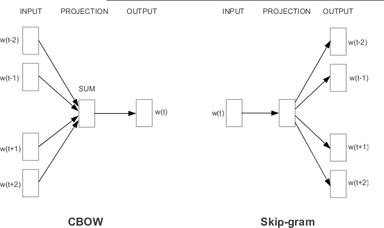 

Mikolov et al. 2013

# word2vec

Skip-gram model:

$$P(c|w;\theta) = \frac{e^{v_c \cdot v_w}}{\sum_{c'\in C} e^{v_{c'} \cdot v_w}}$$

- $c$ is a context word, $w$ is the target word
- $v_c, v_w \ in \mathbb{R}^d$ are vector representations of $c$ and $w$
- $C$ is the set of all available contexts
- parameters are the $v_{c_i}$ and $v_{w_i}$
- this is effectively a shallow neural network with softmax output (similar to TDNN)

# Questions

Wordnet is a labeled database of word relationships:
- antonym("hot", "cold")
- meronym("finger", "hand")

Questions:
- Can you perform semi-supervised learning using Wordnet as labeled training data and word2vec as the unsupervised basis?
- How would you do this more easily using modern language models?

# Sequence Modeling with Neural Networks

- time delayed neural networks (TDNN)
    - $x_t = f_\theta(x_{t-1}, ..., x_{t-k})$
    - special case: $f$ is linear = linear predictive coding
- recurrent neural networks (RNN)
    - $(x_t, h_t) = f_\theta(x_{t-1}, h_{t-1})$
- long short term memory (LSTM)
    - recurrent, with special multiplicative states
- transformer models
    - $x_t = f_\theta(x_{t-1}, ..., x_1)$ using attentional mechanisms

# Convolutional vs Recurrent Networks

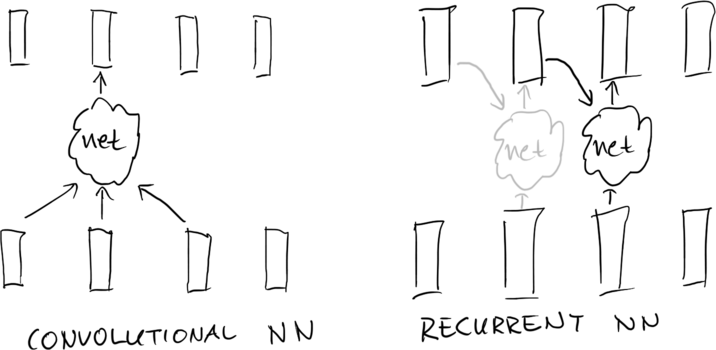

Compare: finite impulse response vs infinite impulse response filters

# Text Generation with LSTM

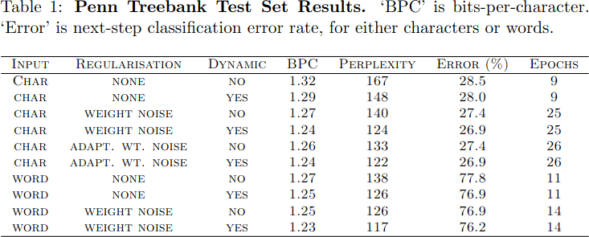 

Predict next character/word from previous, just like n-grams.

Graves 2013, Arxiv 1308.0850

# Text Generation with LSTM

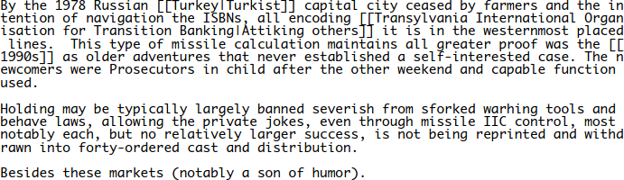 

Graves 2013, Arxiv 1308.0850

# Contextualized Word Vectors

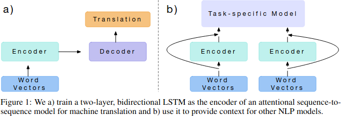 

- CoVe word embeddings = hidden state from machine translation.
- a form of "transfer learning"

McCann et al. 2018, Arxiv 1708.00107

# Deep Contextualized Word Embeddings (ELMO)

- ELMO is language modeling: predict tokens based on context
- self-supervised, no auxiliary tasks
- bidirectional modeling: left-right and right-left predictions
- word embeddings are based on the entire input sequence

# Deep Contextualized Word Encodings

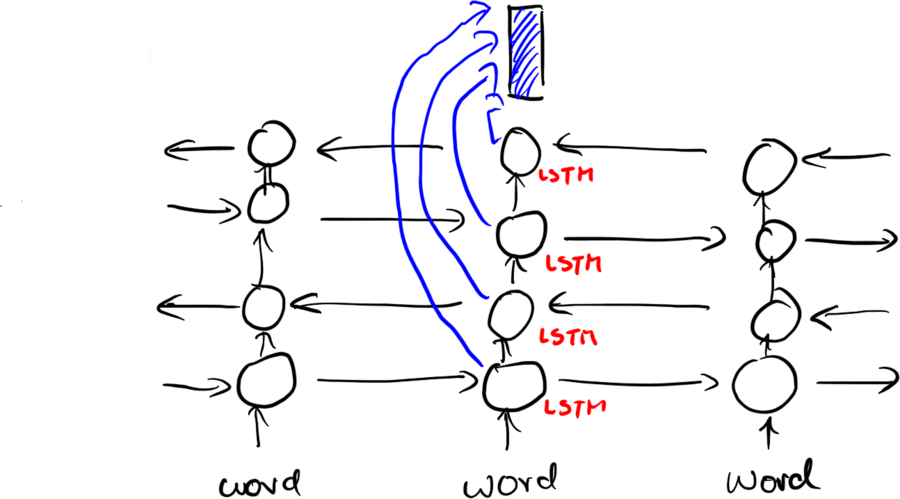

Peters et al. 2018, Arxiv 1802.05365v2

# TRANSFORMERS

# Transformer Architecture

- fundamental change in sequence modeling
    - arbitrarily long term dependencies through content-addressability
    - all time steps trainable in parallel

- "Attention is All You Need" -- because it dispensed with other sequence modeling features and just uses attention

# Transformer Architecture

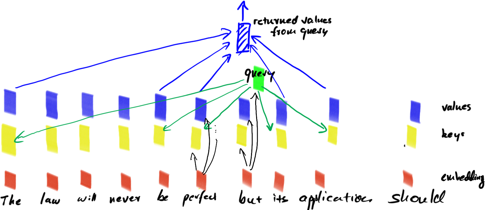

# Transformer Architectures

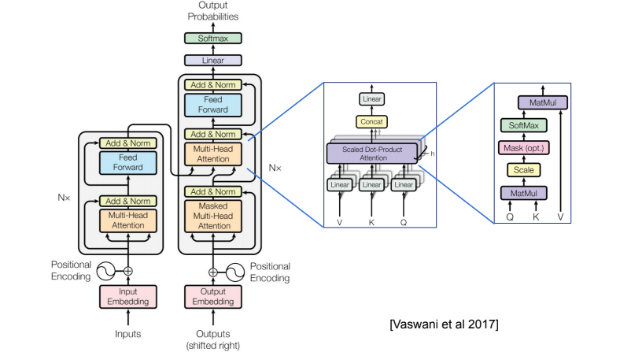 

# Transformer Architectures for Translation

# HMM vs Beam Search

"Time flies like an arrow, fruit flies like _banana_."
"The horse raced past the barn _fell_."

- transformer models use _beam search_: they decode left to right
- HMM's appear to go left-to-right, but actually compute $P(s)$
- solutions:
    - BERT-style models train acausally
    - GPT-style models use large left context and prompts
    - neither quite computes $P(s)$ but they are still useful

<!--
# Transformer Architectures

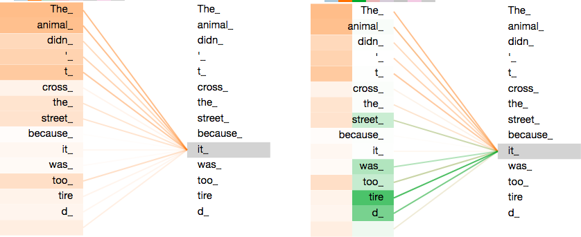

https://www.kaggle.com/code/residentmario/transformer-architecture-self-attention/notebook -->

# BERT

- architecture: multi-layer transformer blocks
- non-causal inputs
- sub-word tokenization
- dataset: books (800M words), Wikipedia (250M words)
- similar to original transformer, GPT
- unsupervised training tasks:
    - word masking (bidirectional context, "Cloze" task)
    - sentence entailment
- fine tune for different tasks

Devlin et al., 2019, Arxiv 1810.04805v2 (Google)

# BERT - Input Encondings

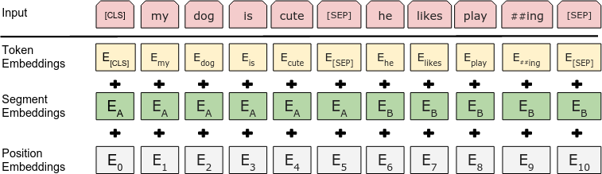 

Devlin et al., 2019, Arxiv 1810.04805v2

# BERT - Pretraining Task 1

"Cats like playing with string."

Mark 15% of the words:
- "Cats like [MASK] with string." (mask, 80%)
- "Cats like eating with string." (replace, 10%)
- "Cats like playing with string." (keep, 10%)

Model must predict correct word in each position.
# BERT - Pretraining Task 2

Balanced binary classification task:

"My cat likes [MASK] with string. [SEP] He [MASK] likes milk." -- True

"My cat likes [MASK] with string. [SEP] Penguins [MASK] flightless." -- False

Masking and entailment are combined.

# BERT Pretraining vs Fine Tuning

 

Devlin et al., 2019, Arxiv 1810.04805v2

# BERT - Results on GLUE Benchmarks

 

Devlin et al., 2019, Arxiv 1810.04805v2

# GPT (Generative Pre-Training)

- GPT
    - large scale unsupervised language modeling as pre-training
    - good zero-shot performance on different tasks
    - 117M parameters, 12 layers
- GPT-2
    - larger dataset (WebText, 40GB, 8M docs)
    - 1.5 billion parameters, 48 layers
- GPT-3
    - 175 billion parameters, 96 layers, 96 heads

# GPT (Generative Pre-Training)

Two step training process:
- unlabeled pre-training on unlabeled text data
- fine-tuning on labeled data

Architecture:
- decoder architecture from original transformer model

Dataset:
- 7000 books

# GPT Architecture and Encodings

 
pretraining: next-word-prediction
fine-tuning: task-only OR next-word + task

Radford et al. 2018 (OpenAI)

# GPT-3 Ancillary Learning Tasks

- WebText for GPT-2 was a high qualitiy text corpus obtained by following links from highly-rated Reddit postings
- This cannot be scaled up further, so how can we obtain more text?
- Solution:
    - train a classifier that distinguished WebText-like text from random Internet text
    - filter a large collection of web pages through the classifier
    - use fuzzy deduplication
- Datasets: Wikipedia, WebText, books, new crawled and filtered dataset

# GPT-3 and Few-Shot Learning

# GPT-3 and Few-Shot Learning

# GPT-3 and Few-Shot Learning

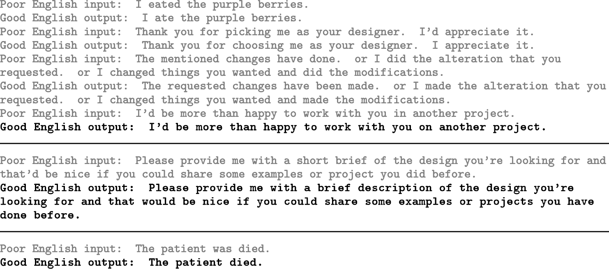

# Why does GPT-3 Few-Shot Learning Work?

Consider paragraph + question "What is the revenue of the company?"

- "The revenue of the company is ..." -- common pattern
- learn grammatical equivalence of patterns, question/answer pairs
- prompts and examples somehow activate contexts

All of these are _statistical patterns and regularities_ in language.

Handcrafted attempts at extracting them in the past have been unsuccessful.

# Why does GPT-3 Few-Shot Learning Work

# BERT vs Prompting

Approaches:

- BERT solves novel tasks by training _heads_ on top of its embeddings
- GPT-3 solves novel tasks through prompting

Characteristics:

- BERT+trained head gives better results than GPT-3 given the same compute resources
- GPT-3 requires no retraining for novel tasks
- GPT-3 performance no novel tasks is hard to predict

# T5 and exT5

- T5 and exT5 are sequence-to-sequence models
- they are trained both unsupervised and supervised
- all tasks are encoded using prompts and tokens
- fine-tuning is also done with string-to-string transforms

# exT5

# Unsupervised / Self-Supervised Sequence Learning

Why does it work so well?

|model    | perplexity |
|---------|------------|
| unigram | 962        |
| bigram  | 170        |
| trigram | 109        |
| GPT-3   |  20        |

- large number of choices, most of them wrong = many bits of unsupervised information
- semantic knowledge helps eliminate large #s of choices

# Sequence Learning vs Intelligence

Large scale semi-supervised training of language models are NOT reasonable models of human cognition:

- humans acquire syntax + semantics with exposure to less than 200M words
- humans derive meaning of language from semantic world models
- semi-supervised language models = Chinese room experiment

However:

- deep language models statistically combined with other sensory modalities might be!

# Take-Home Message for Statistics

- language modeling as self-supervised task has long history
- initial problems
    - estimating $P(s)$ is hard and more than we need
    - mathematical framework made modeling of long-range dependencies difficult
- deep learning provided incremental improvements
- breakthrough came with transformers

# Take-Home Message for Deep Learning

- TDNN, RNNs had too little context, vanishing gradients
- LSTM addressed vanishing gradients, still could not keep large amounts of context
- recurrent networks were slow to train on GPU hardware
- transformers provided breakthroughs:
    - fast training on GPUs
    - no vanishing gradient problems
    - nearly unlimited context

# Take-Home Message for Training from Unlabeled Data

Success for large-scale training of generic language models from mostly unlabeled data:

- predict next item in a sequence
- predict masked content
- combine with transfer learning where available
- ideally, adopt a common framework for everything (T5)
- use deep learning to clean up datasets
- potentially use EM training/pseudolabels, distillation