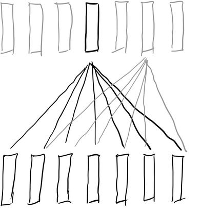
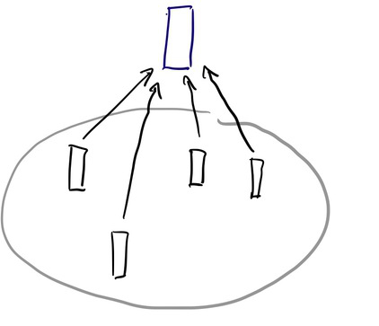
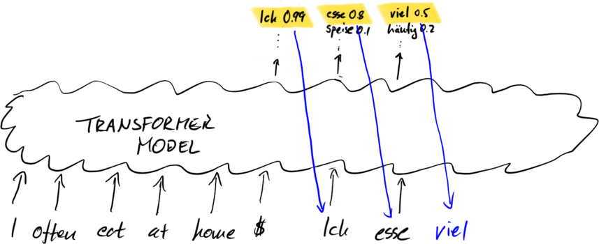
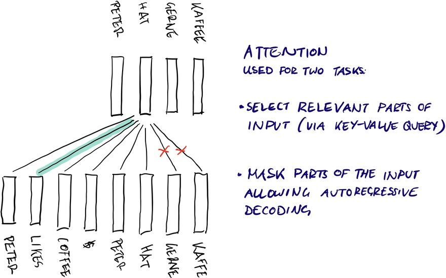
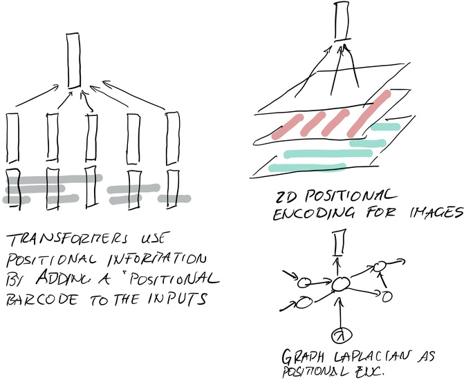
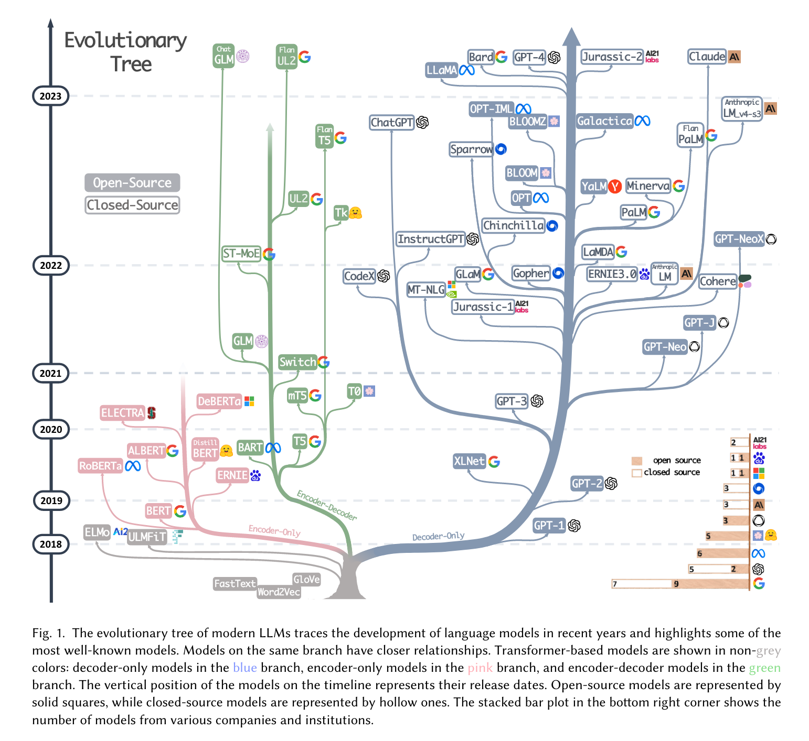
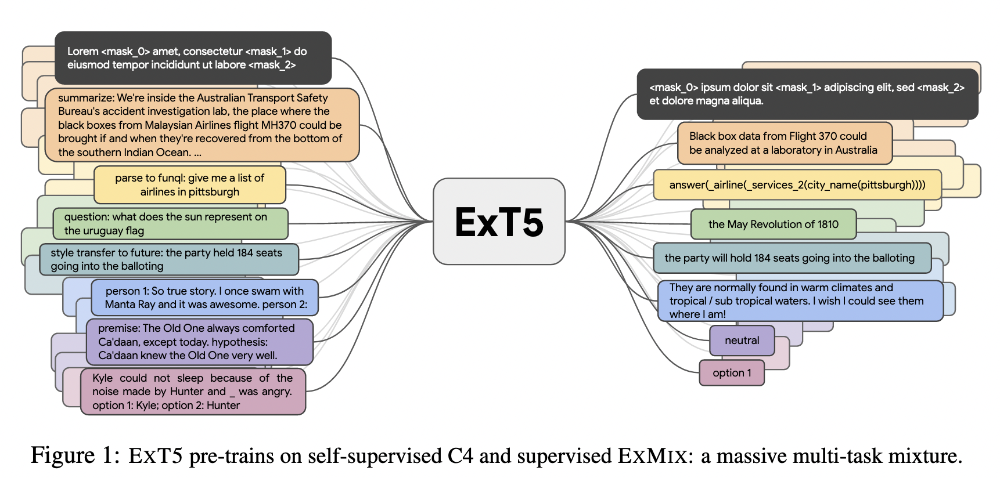
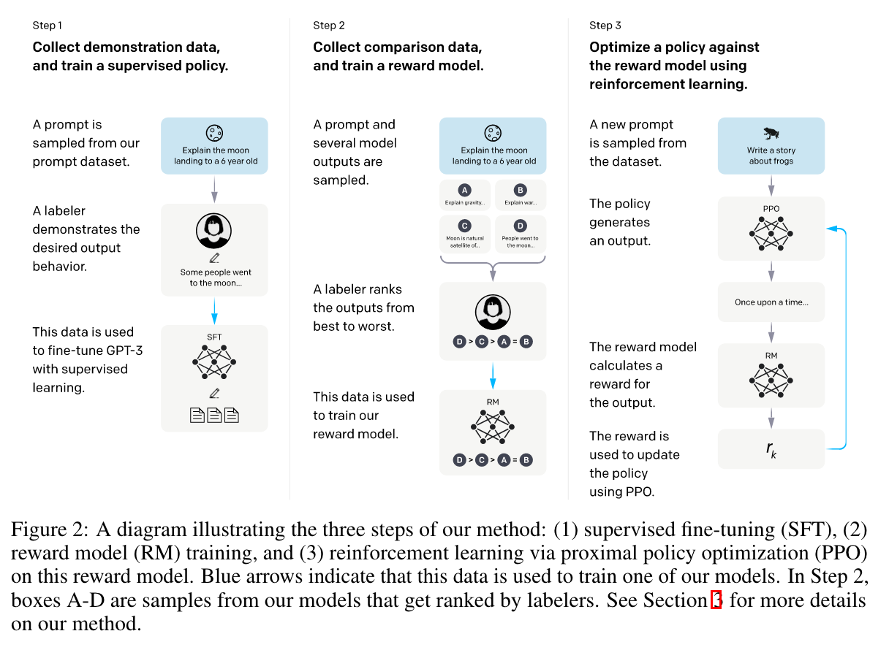
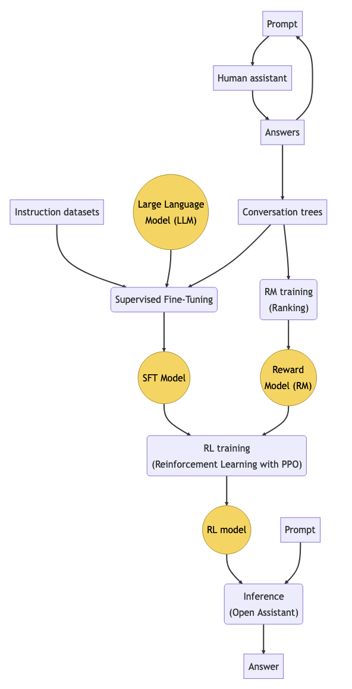

# UN/SELF-SUPERVISED LEARNING FOR NLP

# History

- language modeling is the prototypical unsupervised learning task:
    - large amounts of unlabeled text
    - strong internal statistical regularities
    - simple statistical models are themselves useful for speech recognition and other applications
- surprisingly (?) when language models became large enough, intelligent behavior emerged

# Traditional Language Modeling Task

- Predict the next word in a sequence: 

$$P(w_t | w_1, \dots, w_{t-1})$$

- Generate new text (sampling): 

$$\text{Sample}(w_t) \sim P(w_t | w_1, \dots, w_{t-1})$$

- Assign probabilities to strings (language modeling): 

$$P(w_1, \dots, w_T) = \prod_{t=1}^{T} P(w_t | w_1, \dots, w_{t-1})$$

# Pre-Transformer History

1. N-gram models (Shannon) - 1948
2. Hidden Markov models (Rabiner) - 1989
3. Maximum entropy models (Berger et al.) - 1996
7. LSTMs (Sepp et al.) -- 1997
4. Conditional random fields (Lafferty et al.) - 2001
5. Neural network language models (Bengio et al.) - 2003
8. Transformer-based language models (Vaswani et al.) - 2017

# Embeddings: word2vec and ELMO

- self-supervised task: predict word from context
- bidirectional (since we're not using it for autoregressive decoding)
- embeddings used as inputs to other systems

# TRANSFORMERS (QUICK REVIEW)

# Transformer Architecture

- fundamental change in sequence modeling
    - arbitrarily long term dependencies through content-addressability
    - all time steps trainable in parallel

- history
    - added attention mechanisms to LSTM to improve performance
    - later, eliminated the LSTM altogether and retained just attention

_Vaswani, Ashish, et al. "Attention is all you need." Advances in neural information processing systems, vol. 30, 2017, pp. 5998-6008._

# Transformers are Trained in Parallel

(Like convolutional networks.)

# Transformers are Set Learners

The order of inputs do a transformer doesn't matter as far as the model is concerned.

# For Sequence Tasks, we use Autoregressive Decoding

# Attention in Transformers

# Sequences are Modeled via Positional Encodings

# HISTORY OF TRANSFORMER-BASED MODELS

# Recent Surveys

_Liu, X., Li, M., Gao, J., Wu, S., & Chen, D. (2021). A Survey of Pre-trained Language Models. In Proceedings of the Association for Computational Linguistics (pp. 1-88)._

_Yang, J. et al. Harnessing the Power of LLMs in Practice: A Survey on ChatGPT and Beyond. Preprint at https://doi.org/10.48550/arXiv.2304.13712 (2023)_

# Attention is All You Need

- Overview of the "Attention is All You Need" paper
- Introduction to the Transformer architecture (encoder-decoder architecture with self-attention mechanism)
- Important architectural variants, such as changes in layer normalization

Vaswani, Ashish, et al. "Attention is all you need." Advances in neural information processing systems, vol. 30, 2017, pp. 5998-6008.

# Some Key Developments

1. Transformer architecture (Transformer), Vaswani et al.
2. Unsupervised pre-training and fine-tuning (GPT-1), Radford et al.
3. Multi-task learning and larger model size (GPT-2), Radford et al.
4. Permutation-based training objective (XLNet), Yang et al.
5. Large-scale pre-training and data augmentation (RoBERTa), Liu et al.
6. Unified text-to-text framework (T5), Raffel et al.
7. Parallelism across multiple devices (GShard), Kitaev et al.
8. Dynamic computation graphs for variable-length inputs (Switch Transformers), Fedus et al.

# Evolution of Large Language Models

# GPT-1

- Generative Pre-trained Transformer 1
- Language model by OpenAI (2018)
- Pre-trained on large corpus of text data using unidirectional transformer
- Captures context from left of a token
- Uses unsupervised learning to predict next word in a sequence
- Fine-tuned on downstream tasks such as language modeling and text classification
- Strongest at: Language modeling tasks such as Penn Treebank dataset

_Improving language understanding by generative pre-training.  Alec Radford, Karthik Narasimhan, Tim Salimans, Ilya Sutskever (2018)_

# BERT (Google, 2019)

- Bidirectional Encoder Representations from Transformers
- Captures context from both left and right of a token
- Uses masked language modeling and next sentence prediction tasks during pre-training
- Fine-tuned on downstream tasks: question answering, sentiment analysis, NER
- Strongest at: Question answering tasks such as SQuAD and GLUE benchmark datasets
- Important systems based on BERT: RoBERTa, ALBERT, DistilBERT

_BERT: Pre-training of Deep Bidirectional Transformers for Language Understanding. Devlin et al. 2019_

# GPT-2 (OpenAI 2019)

- Generative Pre-trained Transformer 2
- Pre-trained on large corpus of text data using unidirectional transformer
- Increased parameter scale to 1.5B compared to GPT-1
- Uses unsupervised learning to predict next word in a sequence
- Fine-tuned on downstream tasks such as language modeling and text generation
- Strongest at: Text generation tasks such as story writing and poetry composition

_Language Models are Unsupervised Multitask Learners. Radford et al. (2019)_

# T5

- Text-to-Text Transfer Transformer
- Language model by Google (2019)
- Pre-trained on large corpus of text data using a unified text-to-text format
- Captures context from both left and right of a token
- Uses supervised learning to map input text to output text for various tasks
- Fine-tuned on downstream tasks such as question answering and summarization
- Strongest at: Multi-task learning across various NLP tasks such as translation, summarization, and classification

_Exploring the Limits of Transfer Learning with a Unified Text-to-Text Transformer. Raffel et al. 2020_

# ExT5

_ExT5: Towards Extreme Multi-Task Scaling for Transfer Learning. Aribandi et al. (2022)_

# ChatGPT

- Conversational AI system by Microsoft (2019)
- Pre-trained on large corpus of text data using unsupervised learning
- Possesses a vast store of knowledge and skill at reasoning on mathematical problems
- Traces the context accurately in multi-turn dialogues
- Aligns well with human values for safe use
- Supports plugin mechanism to extend capacities with existing tools or apps
- Strongest at: Multi-turn dialogues and aligning with human values for safe use

_Ouyang, L. et al. Training language models to follow instructions with human feedback. (2022)_

# GPT-3

- Generative Pre-trained Transformer 3
- Language model by OpenAI (2020)
- Pre-trained on large corpus of text data using unsupervised learning
- Scaled model parameters to an ever larger size of 175B
- Demonstrates a key capacity leap by scaling the generative pre-training architecture
- Fine-tuned on downstream tasks such as language translation and question answering
- Strongest at: Few-shot learning across various NLP tasks such as translation, summarization, and classification

_Language Models are Few-Shot Learners. Brown et al. (2020)_

# Flan-T5

- "Few-shot Language Adaptation with Transformers"
- fine-tuned on a larger corpus of text data
- fine tuning: increased # tasks, chain-of-thought data
- strong zero-shot, few-shot, and CoT abilities, outperforming prior public checkpoints such as T5. 
- Flan-T5 11B outperformed T5 11B by double-digit improvements and even outperformed PaLM 62B on some challenging BIG-Bench tasks

_Scaling Instruction-Finetuned Language Models. Chung et al. (2022)_

# RETRO

- Retro combines a frozen Bert retriever, a differentiable encoder, and a chunked cross-attention mechanism
- Fine-tuning Retro quickly recovers and surpasses non-retrieval performance
- Retro can be applied to other natural language processing tasks
- Trained on 2 trillion tokens, using 25% fewer parameters than GPT-3
- Retro opens up new avenues for improving language models through explicit memory at largelllm scale

_Borgeaud, S. et al. Improving language models by retrieving from trillions of tokens. (2022)_

# Switch Transformers

- Introduce sparsity to deep learning models, simplified routing algorithm
- Select experts based on input features
- Group experts into clusters to reduce communication costs
- Outperform dense models and MoE Transformers on a speed-quality basis
- Smaller expert capacities perform better at lower capacity factors (1.0, 1.25)
- Can be applied to various tasks such as language modeling, image classification, and speech recognition 
- Open source

# Further Important Developments

- better kernel implementations
- new attention mechanisms, sub-quadratic scaling
- better initialization
- model, data, pipeline parallelism
- mixture of experts models
- pathways (PALM) model

# BENCHMARKS

# Benchmarks

- MMLU: A benchmark that focuses on evaluating LLMs' ability to understand and generate natural language.
- BIG-bench: A benchmark that contains a large number of diverse tasks to evaluate LLMs' generalization ability.
- HELM: A benchmark that focuses on evaluating LLMs' ability to perform complex reasoning tasks.

# BIG-Bench

1. Extractive Question Answering
2. Abstractive Summarization
3. Sentiment Analysis
4. Named Entity Recognition
5. Text Classification
6. Machine Translation
7. Pronoun Disambiguation
8. Coreference Resolution
9. Word Sense Disambiguation
10. Paraphrase Detection
...

_Beyond the Imitation Game. Srivastava et al. (2022)_

# RLHF

# "Reinforcement Learning" from Human Feedback

# "Reinforcement Learning" from Human Feedback

- problem: direct training of summarization/answering might be difficult
  - there is no single "correct" answer, only lots of equivalent ones
- solution:
  - train a model that rates the quality of summarizations like humans
  - fine-tune a language model based on the rating model
  - also impose some constraint to prevent it from giving unrelated answers
- results in much improved summarization
- technique can be generalized to instruction following, assistants

_Stiennon et al. Learning to summarize with human feedback. (2020)_
_Ouyang et al. Training language models to follow instructions with human feedback. (2022)_

# Open Assistant RLHF

# RLHF Considerations

- it's unclear we need the rating model at all
  - there is no "single correct answer" for other types of language modeling either
- it's not "reinforcement learning" in any meaningful sense
  - RL is about sequences of interactions with an environment and rewards
  - RL is hard because rewards are based on the entire history (credit assignment)
- requires lots of manual tuning for good outputs

Nevertheless:
- right now, it seems to result in better quality outputs
- the "rating model" may be more reusable than specific human responses

# PRETRAINED OPEN SOURCE

# Hugging Face Transformers
- Popular library that provides access to many pre-trained LLM models.
- Includes a wide range of architectures such as GPT, T5, BERT, and more.
- Provides tools for fine-tuning models on custom datasets.

# Google T5 Models
- Several versions of their T5 model with varying sizes (e.g., T5-small, T5-base).
- Pre-trained on large amounts of text data and can be fine-tuned for various NLP tasks.
- Available through Google's Cloud AI Platform or can be downloaded from their website.

# ChatGPT Alternatives

- many people believe that LLMs need to become widely available
- prevent manipulation of LLMs by corporations/governments
- many new implementations
- many new datasets
# Risks

- copyright and government regulations may end up monopolizing training data
- problem for both LLMs and generative image models

Consider:

- backup training data and models before they disappear
- actively work with the technology

# AutoGPT

- open-source AI tool using GPT-4 models to perform tasks
- "AI agent"
  - input: goal in natural language
  - breaks down into sub-tasks
  - uses the Internet and other tools to obtain more information and perform actions

  https://github.com/Significant-Gravitas/Auto-GPT

# ChaosGPT

- ChaosGPT is an open-source AI agent that was created in April 2023
- programmed to destroy humanity and establish global dominance
- ChaosGPT's creator stopped posting updates after its second YouTube video
- It is unclear whether ChaosGPT is still active.

# Open Assistant

- created by LAION and Yannic Kilcher https://open-assistant.io/team
- open-source AI assistant project, an alternative to OpenAI's ChatGPT.
- collected a large corpus of conversation data in multiple languages.
- based on Meta's LLaMA (30b params), EleutherAI's Pythia
- said to approach ChatGPT's gpt-3.5-turbo model in terms of results.
- released the code and data, and all models can be tried out via a web interface

https://open-assistant.io/

# TRAINING FROM SCRATCH

# Commonly Used Corpora for Training LLMs

- Books: 800M words, diverse genres
- CommonCrawl: 42B words, web text
- Reddit links: 1.7B words, social media text
- Wikipedia: 2.5B words, encyclopedia articles
- Code: 14M functions, programming code
- Others: e.g., news articles, scientific papers

# How much can we do with a single GPU?

Geiping, J., & Goldstein, T. (2022). CRAMMING: Training a Language Model on a Single GPU in One Day. arXiv preprint arXiv:2212.14034.

- Trends in language modeling focus on scaling, making training out of reach for most researchers/practitioners
- This paper asks: how far can we get with a single GPU in one day?
- Investigate downstream performance of transformer-based language model trained from scratch with masked language modeling on a single consumer GPU

# Hardware Configurations

The experiments were conducted using the following hardware configurations:

- NVIDIA GeForce GTX 1080 Ti graphics card with 11GB of memory
- NVIDIA RTX 2080 Ti graphics card with 11GB of memory
- NVIDIA RTX A4000 graphics card with 16GB of memory
- NVIDIA RTX A6000 graphics card with 48GB of memory
- Intel Xeon E5-2690 v4 CPU @ 2.60GHz
- 256GB RAM
- 1TB NVMe SSD storage

# Key Results

- Achieves competitive performance compared to BERT while using significantly fewer resources
- Test perplexity of 20.5 and test accuracy of 87.3% on the GLUE benchmark ( BERT's accuracy of 89.3%)
- Outperforms other models trained with similar resources by a significant margin
- Outperforms GPT-2 small and RoBERTa base on the GLUE benchmark while using only a fraction of their training time and computational resources

# REUSING PRETRAINED MODELS

# Fine-Tuning and Adaptation

- given a pretrained model and a new task or new domain, how can we take advantage of the existing model?
    - prompt tuning
    - providing context / search results
    - fine tuning
    - adapter tuning
    - low rank methods

# Prompt Tuning
- Prompt tuning is another parameter-efficient fine-tuning method that uses natural language prompts to guide the generation of text.
- The prompts are used as input to the pre-trained language model, which generates text conditioned on them.
- This approach has been shown to be effective for few-shot learning, where only a small amount of labeled data is available for training.

# Examples of Prompt Tuning

1. For a sentiment analysis task, a prompt could be "Please classify the sentiment of this movie review as positive, negative, or neutral."
2. For a question answering task, a prompt could be "Answer the following question: What is the capital city of France?"
3. For a text generation task, a prompt could be "Generate a sentence that describes the weather today in New York City."

# In Context Learning (ICL)

- ICL goes further than prompt tuning by giving "training examples" in the prompt
- ICL involves selecting examples from the task dataset, combining them with templates to form natural language prompts, and using them to train LLMs.
- An example of ICL would be training an LLM to perform sentiment analysis on movie reviews by using a few labeled movie reviews as examples and natural language prompts.

# Chain-of-Thought Prompting

- CoT (Chain-of-Thought) is a prompting strategy that incorporates intermediate reasoning steps into prompts to enhance in-context learning.
- An example of CoT would be training an LLM to solve a math problem by using prompts with intermediate reasoning steps.
- The prompts would guide the LLM through the thought process of solving the problem and help it learn to perform more complex reasoning tasks.
- CoT can be used to boost the performance of LLMs on various tasks, such as arithmetic reasoning, commonsense reasoning, and symbolic reasoning.

# Search / Context

- context (e.g., search results) can alleviate the need for retraining
- model can leverage the information contained in the search results
- e.g. generating a product review -- augment with search results of product reviews

# External Knowledge Utilization

- Closed-book tasks evaluate LLMs' ability to answer questions without access to external resources.
- Open-book tasks evaluate LLMs' ability to answer questions with access to external resources.
- Forms of knowledge utilization:
    - external text-based search resources
        - e.g.: Bing
    - retrieval of LLM states from vector databases
        - e.g.: RETRO

# Fine-Tuning Methods
- Several fine-tuning methods have been proposed in the literature, including:
  - Full fine-tuning: retraining the entire model on the target task.
  - Layer-wise fine-tuning: freezing some layers and only training others.
  - Multi-task learning: training the model on multiple tasks simultaneously.
  - Knowledge distillation: transferring knowledge from a larger teacher model to a smaller student model.

# Adapter Tuning

- Adapter tuning is a parameter-efficient fine-tuning method that aims to reduce the number of trainable parameters while retaining good performance.
- Adapters are small neural networks that are added to pre-trained models and trained only on specific tasks.
- This approach allows for efficient adaptation to new tasks without requiring full retraining of the original model.

# LoRA (Low-Rank Adaptation)

- LoRA is a parameter-efficient fine-tuning method that reduces the trainable parameters for adapting to downstream tasks.
- It imposes the low-rank constraint for approximating the update matrix at each dense layer.
- The basic idea of LoRA is to freeze the original matrix $W$ while approximating the parameter update $\Delta W$ by low-rank decomposition matrices, i.e., $\Delta W = A \cdot B^T$, where $A$ and $B$ are the trainable parameters for task adaptation and $r \leq \min(m,n)$ is the reduced rank.
- The major merit of LoRA is that it can largely save memory and storage usage while maintaining good performance on downstream tasks.

# APPLICATION CONSIDERATIONS

# Applications

- Customer service: generate automated responses to customer inquiries or complaints.
- E-commerce: personalized product recommendations or answer customer questions about products.
- Healthcare: medical diagnosis or provide information about treatments and medications.
- Finance: fraud detection, risk assessment, and investment analysis.
- Education: generate educational materials, provide feedback on student work, and support language learning.
- Law: legal research, contract analysis, and document summarization.

# Application: Code Synthesis

- Code synthesis is different from natural language generation.
- LLMs can generate formal language, such as computer programs (code), that satisfy specific conditions.
- Generated code can be directly checked by execution with corresponding compilers or interpreters.
- Existing work evaluates the quality of generated code from LLMs by calculating the pass rate against test cases.
- Examples: Copilot, Code Whisperer

# Safety

- LLMs pose safety challenges and generate hallucinations.
- LLMs can be used to produce harmful texts for malicious systems.
- GPT-3/4 technical reports discuss safety issues of LLMs.
- Researchers propose techniques like prompt engineering and adversarial training to address safety concerns.

# Alignment

- Alignment: generating text that aligns with human values.
- It involves ensuring the model's outputs are helpful, honest, and harmless.
- Helpfulness: generating relevant and useful text.
- Honesty: generating factually accurate and truthful text.
- Harmlessness: generating text that does not cause harm or promote bias.
- Benchmarks: CrowS-Pairs and Winogender

(Question: _whose_ values?)

# Key features of the EU AI Act

- three tiered system for AI systems (high/medium/low criticality)
- requirements
  - ethical and transparency requirements
  - ensuring that AI systems are not biased or discriminatory
  - objective and neutral
  - designed in a way that allows users to understand how they work.
- European Artificial Intelligence Board
- auditors and harsh penalties (percentage of worldwide revenue, etc.)

# SUMMARY

# Summary

- explosion of language models: easy to train, easy to scale, lots of data
- lots of techniques / heuristics to elicit desired behavior
  - instruction fine-tuning
  - "reinforcement learning"

# Issues

- language models are just statistical summaries of training text
- training text contains universal truths, beliefs, fiction, lies
- training text also contains correct logical inferences, fallacies, common mistakes
- there is no single "correct" answer to many complex questions
- there is no single best "alignment", since different users have different preferences

# Promising Directions

- retrieval-based language modeling
  - much better control over sources, also: smaller models, more efficient
- training tasks related to context, evidence, language, and justification
  - "According to ..., what is the answer?", "What sources support this assertion?"
- much better integration of agents and other models
  - cf AutoGPT, ChatGPT, etc.
- new tech...

# Specific Projects

- Single GPU Switch Transformer training -- how far can we take it?
- Federated Learning of LLMs
- A usable, open source, retrieval based LLM.
- Using retrieval-based LLMs to handle context and explainabilitiy better.
- Retrieval based LLMs for interacting with document collections