# SEMI-SUPERVISED LEARNING IN VISION

# Already covered...

We have already covered (in the OCR case):

- pseudo-labels
- active learning
- data augmentation and prior knowledge of invariances
- EM algorithms

# Pre-Transformer Approaches

Prior attempts to carry over principles for language models and HMMs to the image domain:

- linearize images and apply HMM or LSTM models
- apply VQ to patches and apply syntactic models to the resulting "visual words"
- corrupt images with noise and training a network to restore them
- predict color images from grayscale
- mask parts of images and predict the masked parts (like BERT)
- determine the spatial relations between patches (like entailment)

All of these yield deep learning architectures that are potentially useful for transfer learning, but never beat supervised models.

# Masked Predictions

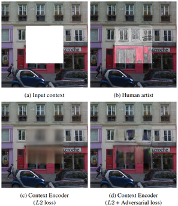 

Pathak et al. 2016

# Split-Brain Autoencoder

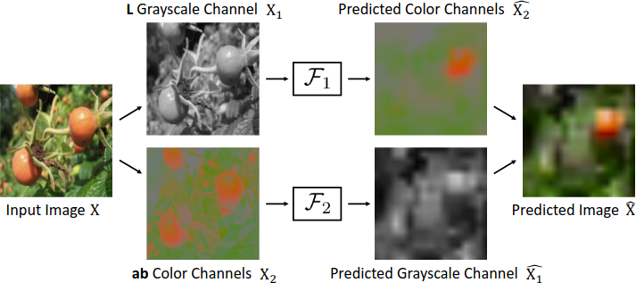 

Zhang et al. 2016

# Context Encoding

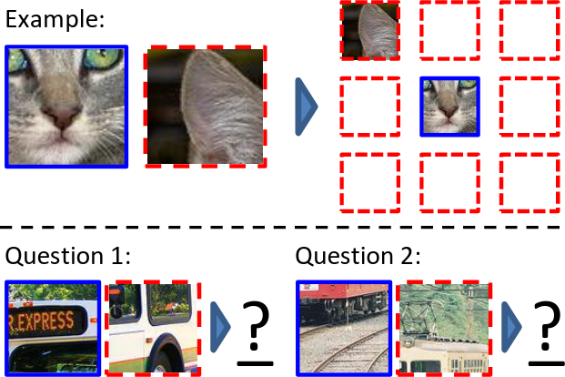

Doersch et al. 2016

# VISION TRANSFORMERS

# Vision Transformers

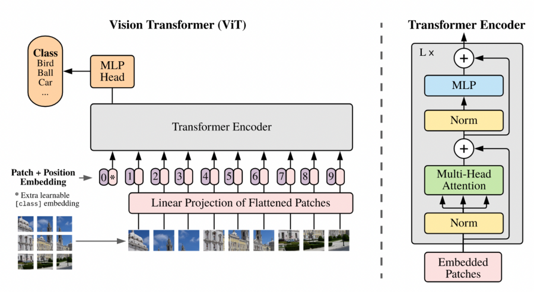

The NLP transformer architecture carries over directly to images: just change the positional embedding.  Dosovitskiy et al. 2020, arXiv:2010.11929

# BEiT - BERT Pre-Training of Image Transformers

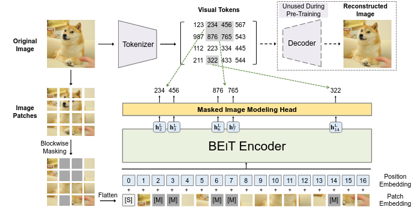 

BERT-like pretraining carries over directly. Bao et al., 2022

# Masked Autoencoder (MAE)

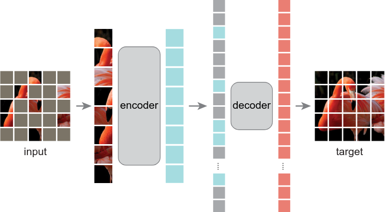 

MAE uses a simpler architecture and no tokenization. He et al. 2021

# Masked Autoencoder - Reconstructions

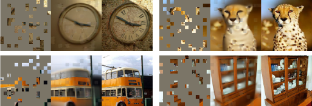 

He et al. 2021

# Masked Autoencoder - Transfer Learning

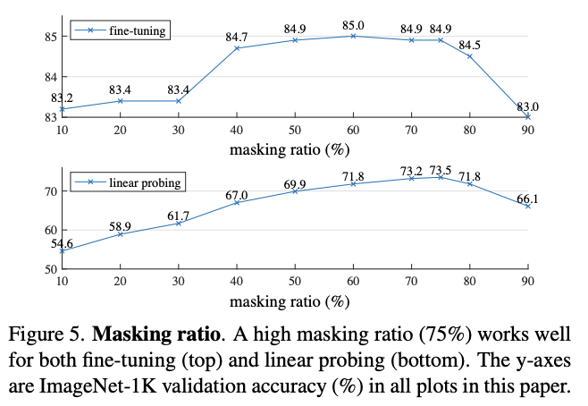

# Unsupervised Training with Transformers

Transformer architectures make BERT-like masking useful unsupervised pre-training for image-related tasks.

# OTHER APPROACHES

# SimCLR - Contrastive Learning

Basic idea:

- generate two differently augmented versions of the same image
- train a representation that is as similar as possible for the same image, different for different images

Details:

- carefully choose augmentations, watch out for trivial solutions (e.g. color)
- separate representation from scoring
- compute "softmax over cosine similarity" over very large batches
- implemented with ResNet

# SimCLR - Contrastive Learning

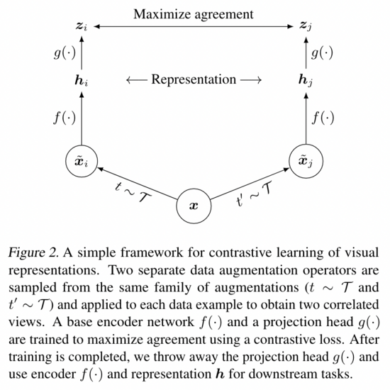

Chen et al., 2020; arXiv:2002.05709

# SimCLR - Augmentations

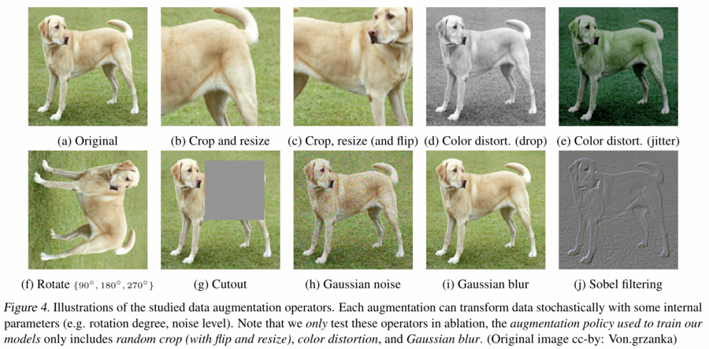

# SimCLR - Transfer Learning Performance

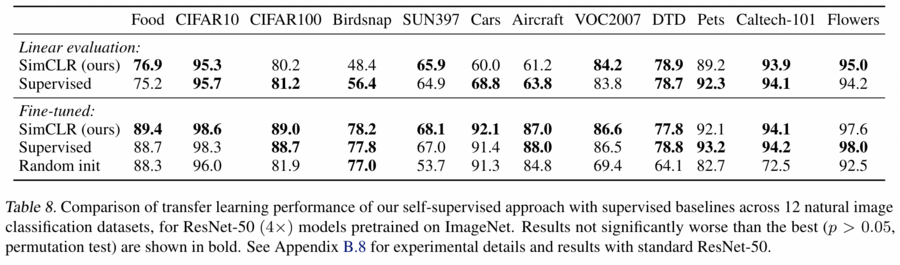

# DINO

- self-DIstillation with NO labels
- discovers labels / class structure by itself
- unsupervised representation learning for images
- impressive semantic segmentation results
- attention map = segmentation map
- vision transformer or ResNet 50 based

# DINO Architecture

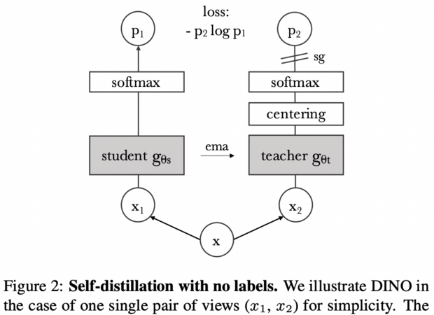

# DINO Results

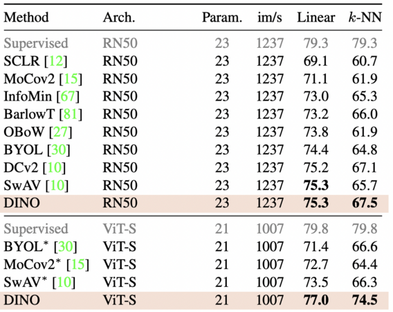

# DINO Segmentation

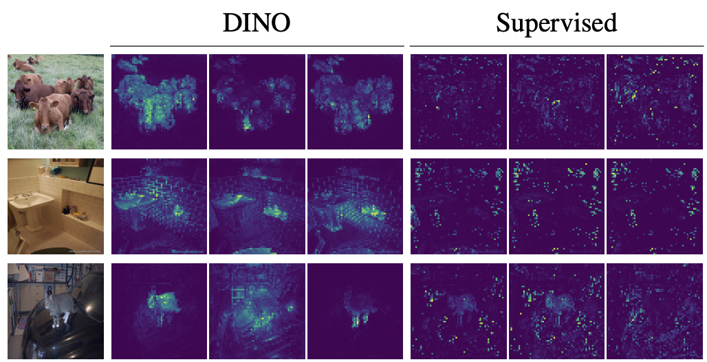

- semantic segmentation by attention looks better than from supervised models

# Summary: SimCLR and DINO

High Level:

- SimCLR is a kind of _representation_ or _metric_ learning
- DINO is a kind of _clustering_
- implementations are complex and with lots of hyperparameters

Conclusions:

- tasks like these may be most useful as additional tasks combined with masking (just like BERT)

# COMBINING TEXT AND IMAGE MODELS

# Combining Image and Text Models

- GPT-3, ExT5, etc. show how natural language models can be used for zero short learning
- CLIP
    - use natural language supervision for image recognition (weak supervision)
    - vision: transformer or ResNet, language: transformer
    - permit "prompt engineering" to allow different kinds of NLP tasks
    - uses contrastive pretraining (rather than, say, captioning)

# CLIP Architecture

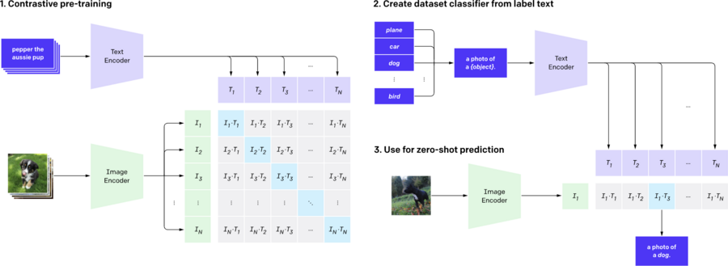

# CLIP Results

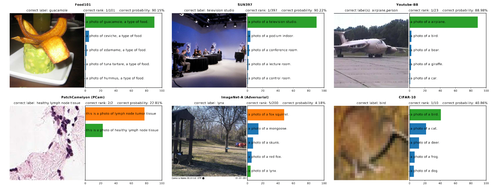

# CLIP Results

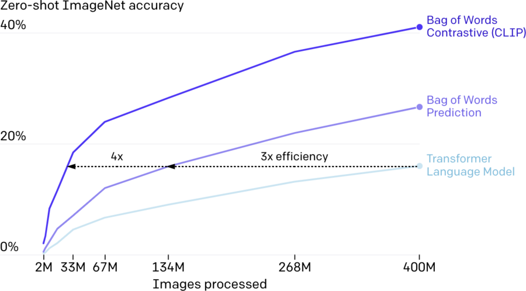

# Discussion

Current and future directions:

- combining text and image
- integrating unsupervised pretrained vision and language models
- integrating video and audio and identifying good self-supervised tasks for these (e.g., VideoMAE, Audio-MAE)
- cross-modal combinations likely also reduce the amount of training data required within each modality