# GENERATIVE AND DENSITY MODELS

# Traditional Approaches

- parametric density estimation
- mixture models
- Bayesian networks
- causal models
- Boltzmann machine
- restricted Boltzmann machine
- Energy Based Models

# Flow Models

want:
- representation of complicated densities $p_\theta(x)$
- learn $\theta$ from training data $\{x^{(i)}\}$
    - maximum likelihood $\arg\max_\theta \sum_i \log p_\theta(x^{(i)})$
    - equivalently $\arg\min_\theta \mathbb{E}_x[-\log p(x)]$
- be able to evaluate $p_\theta(x)$ and sample from it

have:
- parametric representation of simple densities
- learnable non-linear functions $f_\theta(x)$

# Flow Models Idea

- model some complicated $p(\xi)$
- given $x \sim p(x) = {\cal N}(0, {\bf 1})$
- learn an invertible function $x = f_\theta(\xi)$

# Flow Models Idea - Linear Mapping

Linear mapping between ${\cal N}(0, {\bf 1})$ and general normal density:
- $\xi \sim {\cal N}(0, \Sigma)$
- $x \sim {\cal N}(0, {\bf 1})$
- let $\Sigma = U^TDDU$
- then $x = D^{-1}U \xi$

However: we need to adjust the normalization:
- ${\cal N}(0, {\bf 1}) = \hbox{~~~~~~~~~~~~~~~~~~~}(2\pi)^{-n/2}\exp(\frac{1}{2}x^Tx)$
- ${\cal N}(0, \Sigma) = \det(\Sigma)^{-1/2}(2\pi)^{-n/2}\exp(\frac{1}{2}x^T\Sigma^{-1}x)$

We need to change the normalization factor because the linear mapping changes volumes.

# Flow Models - General Mappings

Generalization:
- the local linear relationship between $x$ and $\xi$ is given by the Jacobian $J_{f_\theta}$
- we account for the volume change using the determinant of the Jacobian
- $p(x) = p(\xi) \cdot \det(J_{f_\theta}(\xi))$

Updating the loss function:
- $\arg\min_\theta \mathbb{E}_x[-\log p(x)] = \arg\min_\theta \mathbb{E}_x[-\log p(f_\theta(x)) - \log\det(J_{f_\theta}(\xi))]$

# Flow Models - Illustration

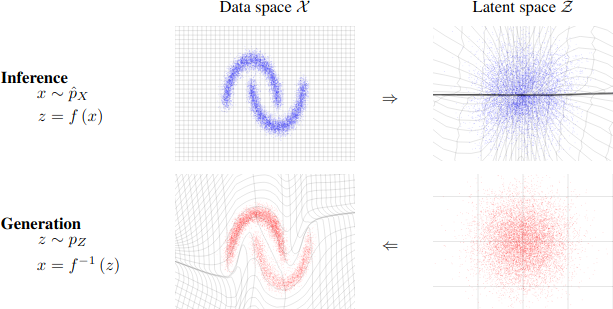

Dinh et al. ICLR 2017

# Flow Models - Technicalities

- mappings compose: if $f = g \circ h$
    - then $p(x) = p(\xi) \cdot \det(J_g(h(\xi))) \det(J_h(\xi))$
- regular linear layers are too costly to invert, use affine coupling layers instead (NICE/RealNVP)
    - split input to layer in two halves $x = (x_l, x_h)$
    - $y_l = x_l$
    - $y_h = x_h \odot f_\theta(x_l) + g_\theta(x_l)$ (elementwise affine)
    - the Jacobian is triangular, so its determinant is the product of the diagonal elements
- need to "dequantize" images
- other options: mixtures of logistics, continuous time flows, ...

# Flow Models - Examples

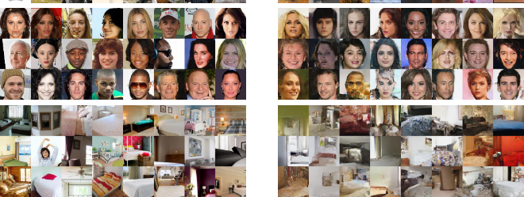 

Dinh et al. ICLR 2017

# Traditional Autoencoder Limitations

Limitations
- encoder could just pick arbitrary codebook in latent space and encode each sample
- small changes in latent space not guaranteed to correspond to small changes in output

The variational autoencoder (VAE) addresses these issues.

# Variational Autoencoder

Solution:
- map each input vector $x$ to a conditional distribution over $y$
- specifically
    - output parameters for a parametric distribution $p_\phi(y|x)$
    - choose $p_\phi(y|x) = {\cal N}(y, \mu_x, \Sigma_x)$
    - move $p_\phi(y|x)$ towards ${\cal N}(0, {\bf 1})$
- reconstruct $x$ by sampling from that conditional distribution

# VAE

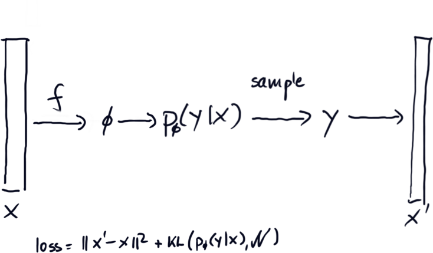

# VAE Objective

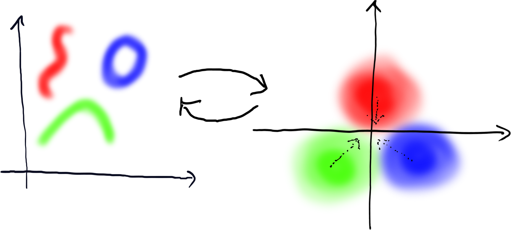

# VAE Structure

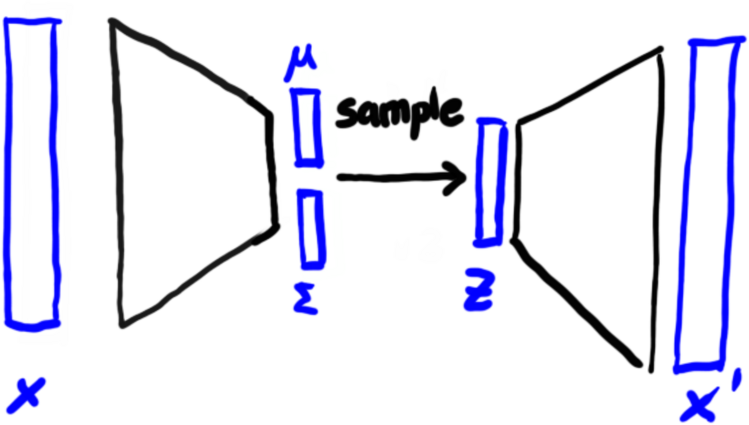

# VAE Technical Details

- previous slides gave a high-level idea of what the VAE is trying to accomplish
- many implementation details are not described:
    - the loss involves sampling--how do we deal with that?
    - how should we sample the latent space?
    ...

# VQ-VAE

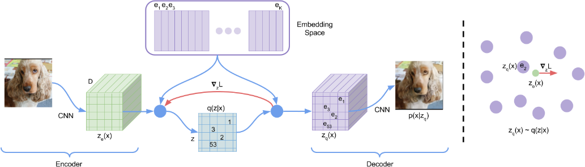 

van den Oord et al., Arxiv 2018

# Generative Adversarial Models

- sampling-only models
- sample from an underlying distribution $z \sim p(z)$
- compute output as $f_\theta(z)$, inducing some $p_\theta(x)$
- for other models, we tried to make $p_\theta(x)$ close to the data
- with GANs, we cannot access $p_\theta(x)$, only sample from it

# Adversarial "Game"

- Discriminator
    - receives real and generated samples
    - attempts to discriminate between the two as best as possible
- Generator
    - tries to generate samples that the discriminator cannot distinguish

Loss: $\rho \log D(x) + (1-\rho) \log(1 - D(G(x))$

$\rho$: indicator whether sample is real

# GAN

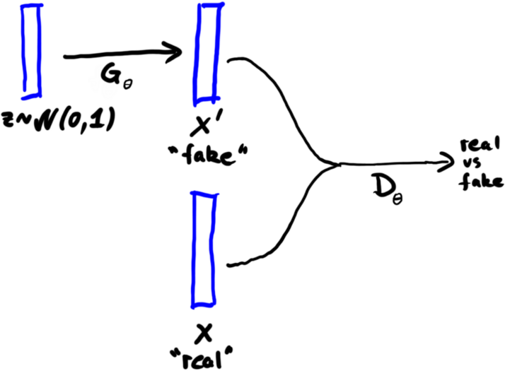 

# Major Difficulties Implementing GAN

Low Signal to Noise

- the discriminator only gives us 1 bit of information
- solution: patchwise discrimination or convolutional output

Discriminator Saturation

- if $D(x)$ is highly confident, it generates little useful gradient
- solution: use simple $D(x)$ or 

# Major Difficulties Implementing GAN

Mode Collapse

- if $p(x)$ is multimodal, outputting a single mode may be sufficient
- solution: use loss functions that use entire batches and/or history

# Wasserstein GAN

Wasserstein Distance between Distributions $P_r$ (real), $P_f$ (fake).

$W(P_r, P_f) = \inf_{\gamma\in\Gamma(P_r, P_f)} \mathbb{E}_{(x,y)\sim\gamma} [ ||x-y|| ]_~$

Here, $\Gamma(P_r, P_f)$ is the set of all joint distributions with the two given marginals.

Earth Mover's Distance: how costly is it to move one distribution mass to the other

Becomes tractable via the Kantorovich-Rubinstein Duality.

# Original GAN Results

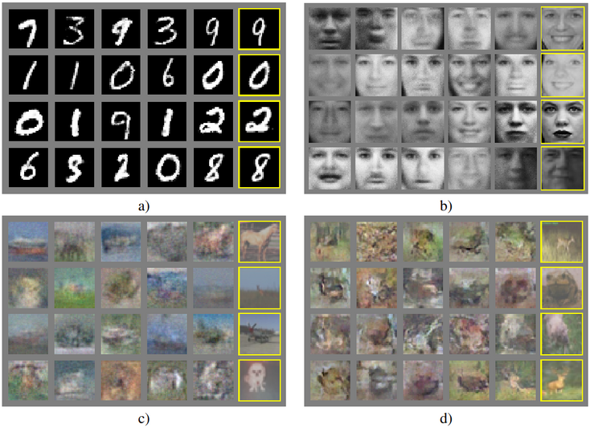 

# DCGAN - Architectural Improvements

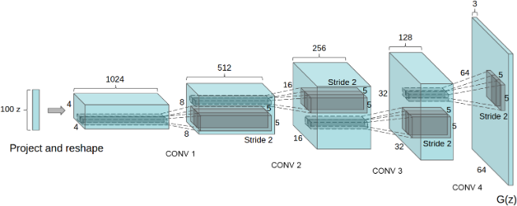 

Radford et al., 2016; Arxiv 1511.06434

# DCGAN - Results

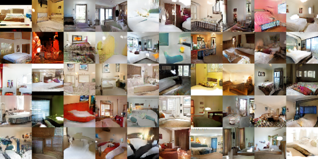 

Radford et al., 2016; Arxiv 1511.06434

# DCGAN - Representation Learning / Features

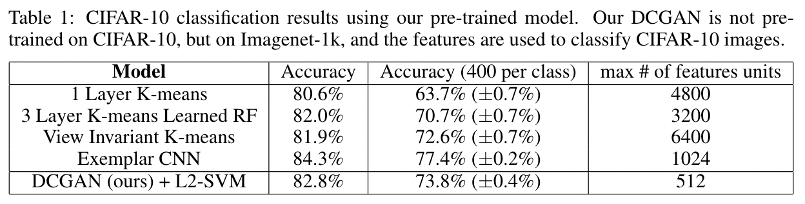 

Radford et al., 2016; Arxiv 1511.06434

# Conditional GAN

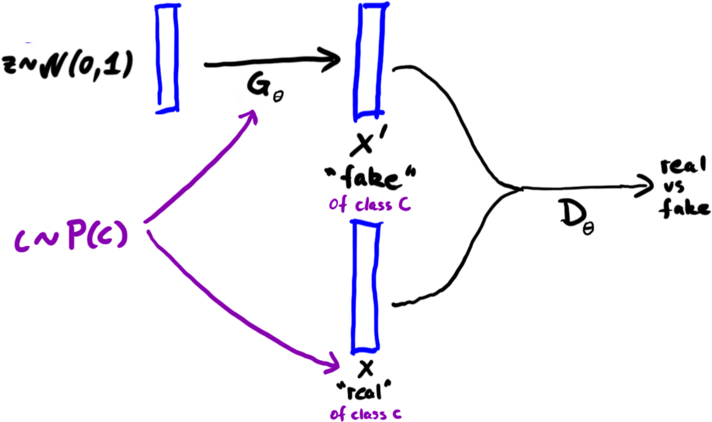 

# InfoGAN

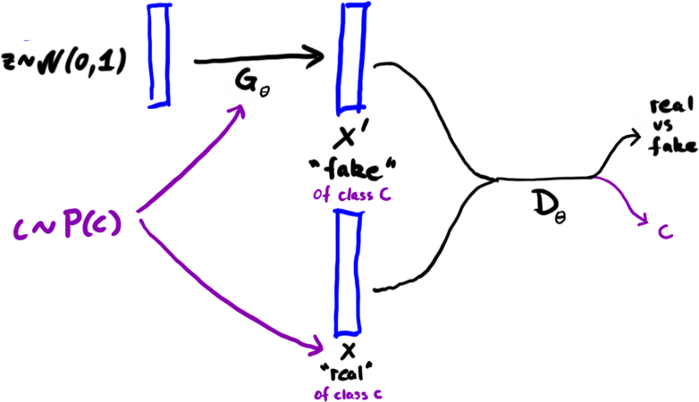 

# InfoGAN - Disentangling Latent Codes

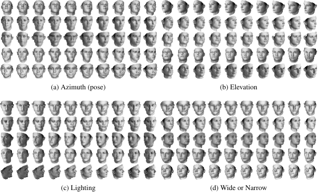 

# BigGAN Results

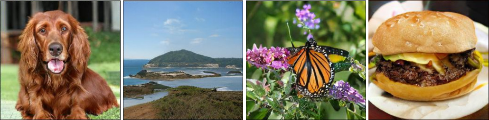 

# CLIP - Text Supervision

Radford et al., 2021; Arxiv 2103.00020v1

# CLIP - Results with Prompts

Radford et al., 2021; Arxiv 2103.00020v1

# CLIP - Semi-Supervised / Transfer Learning

- zero-shot classification with "A photo of ______" prompts.
- careful prompt engineering, ensembling provides improvements
- zero-shot outperforms task-specific ResNet 50

# DISTRIBUTION ALIGNMENT

# Problem

Assume we have two different but related distributions $p(x)$ and $p'(x)$.

Examples:

- daytime vs nightime images
- outdoors scenes in sunshine vs rain
- photographic images vs oil paintings
- clean binary document image vs photographic capture

Can we find an "optimal" function to map $x \rightarrow x'$?

# Supervised Training

This is a typical supervised training problem if we have image pairs $(x, x')$.

Optimize:

$$\mathbb{E} || x' - f_\theta(x) ||^2$$

Typical architectures: U-Net, LSTM

# Unsupervised Training

We can only obtain samples $x$ and $x'$, but they don't correspond.

Can we still succeed?

# Alignment of Mixture Densities (no other info)

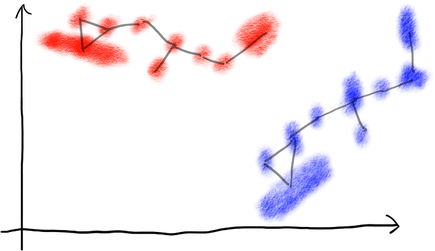

- distribution alignment is possible for distributions with a lot of structure
- ... if the "general shape" of the distribution is preserved

# Alignment of Mixture Densities (with sequences)

- syntactic constraints (e.g. sequences of samples) help with distribution alignment
- this is what EM training for OCR, speech, etc. tends to do

# Uses of Distribution Alignment for Training

E.g. AV images: summer and winter, lots of summer training data, little winter training data

Approach 1:
- train model on summer + translate winter to summer

Approach 2:
- use distribution alignment to generate lots of winter images from summer images, then augment the training set with that
- train model on summer images and artificially generated winter images

# Distribution Alignment

Distribution alignment yields a kind of invariance:

$P(c|x) = P(c|f(x))$

Such invariances can be used in two ways:

- compute a canonical, invariant representation 
- augment the training set with transformed training samples

Both are used in practice.
# CycleGAN

- two generators $G': x \rightarrow x'$, $G: x' \rightarrow x$
- two discriminators: $D'$ (discriminates real/fake $x'$), $D$ (discriminates real/fake $x$)
- train $G, D$ and $G', D'$ like a regular GAN
- require that $G' \circ G$ and $G \circ G'$ behave like identities

# CycleGAN Examples

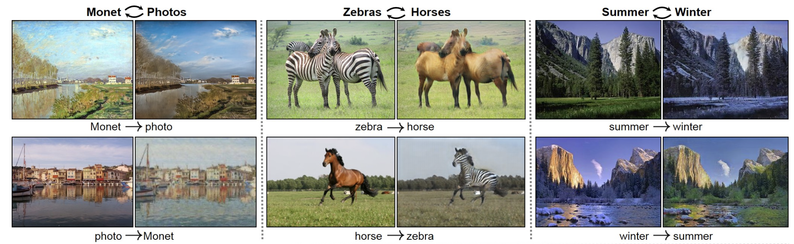

# CycleGAN Examples

# CycleGAN

- discriminators $\approx$ syntactic constraints
    - architecture $\approx$ choice of constraints
- generators $\approx$ mapping between distributions
    - architecture+init $\approx$ choice of possible transformations

CycleGAN will generally try to keep images similar unless discriminators require deviation.

<!--
# Diffusion Models

 

-->